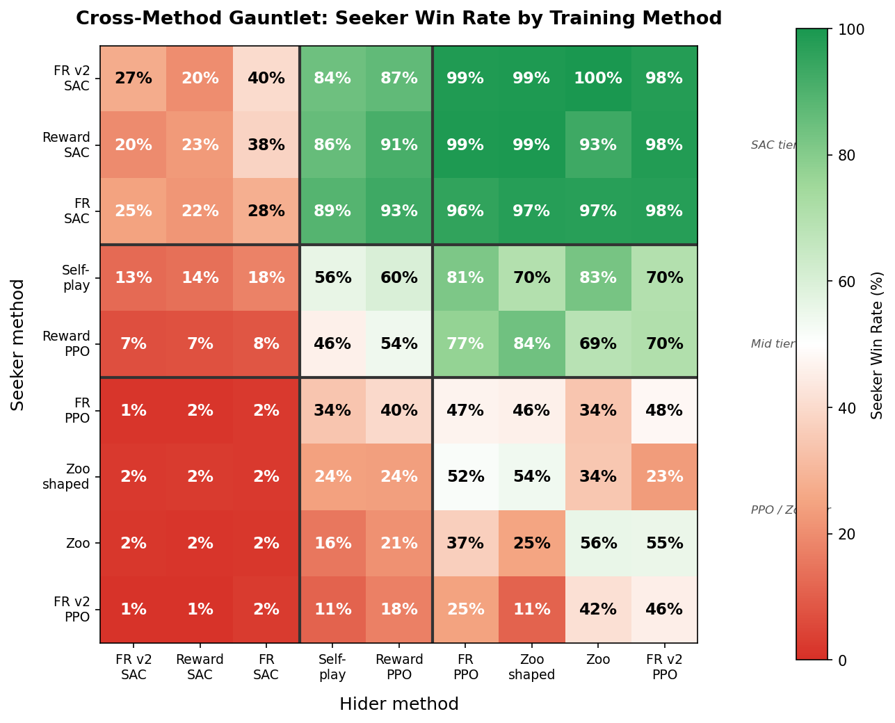
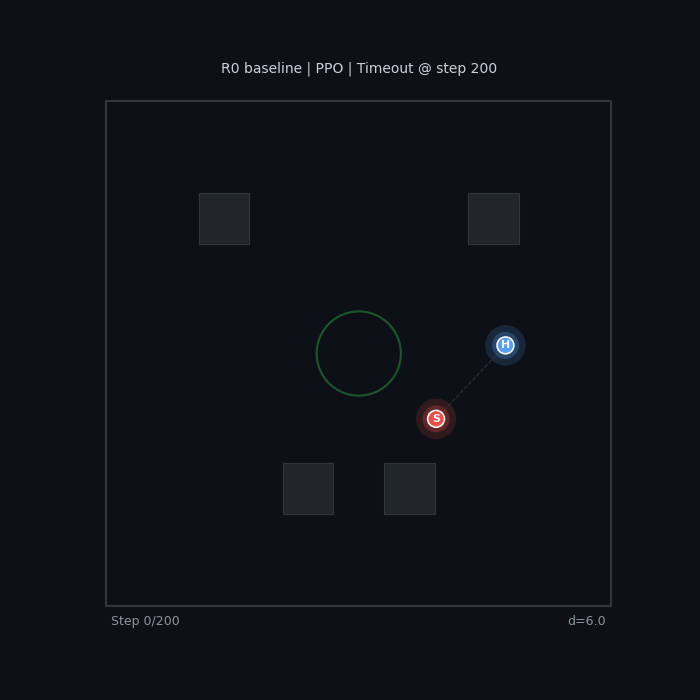
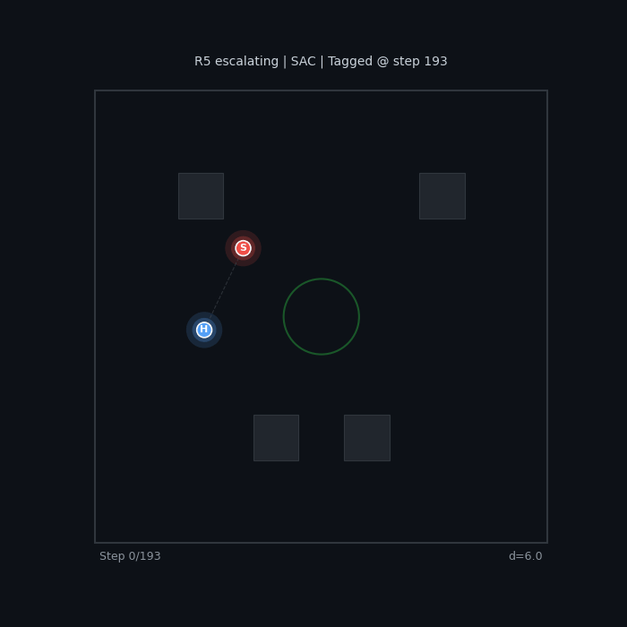

# AI Plays Tag

<p align="center">
  
  <br>
  <em>The strongest seeker vs the strongest hider from 616 trained agents — 10 rounds with live score.<br>
  Both are SAC agents from Optuna-optimized zoo training with reward shaping.</em>
</p>

Two RL agents learn to play tag in a 2D arena with obstacles. The **seeker** (red) tries to catch the **hider** (blue) before time runs out. We train agents with PPO and SAC across multiple paradigms — self-play, zoo training, reward shaping — and pit them against each other to find what actually matters.

**The big finding: algorithm choice (SAC vs PPO) dominates everything else.** Zoo mixing, reward presets, hyperparameter tuning — none of it closes the gap.

**[Reward Shaping Study](https://kilojoules.github.io/AI-Plays-Tag/reward_shaping/)** | **[HPO & Zoo Mixing Study](https://kilojoules.github.io/AI-Plays-Tag/hpo_study/)** | **[Project Page](https://kilojoules.github.io/AI-Plays-Tag/)**

---

## The Game

A 30x30 arena with 4 obstacles and a central safe zone. Each agent observes position, velocity, the opponent's relative state, and **36 vision rays** (120 FOV). Actions are continuous 2D accelerations. Episodes last 200 steps; the hider has a speed advantage (up to 20% faster).

Two parameters control difficulty:

| Parameter | Effect |
|---|---|
| **Seeker Time Penalty (STP)** | Per-step cost on the seeker — higher = more pressure to tag quickly |
| **Hider Speed Multiplier (HSM)** | Hider speed relative to seeker — above 1.0 = the hider is faster |

---

## The A-Parameter Hypothesis

In standard self-play, both agents train against each other's latest policy. This is efficient but fragile — the seeker can overfit to the current hider and forget how to beat earlier strategies (*catastrophic forgetting*).

**Zoo training** offers an alternative. The seeker maintains a "zoo" of archived hider checkpoints and trains against a mixture:

- With probability **A**: play against a randomly sampled **past hider** from the zoo
- With probability **1-A**: play against the **latest hider** (self-play)

We hypothesized that zoo mixing would reduce forgetting and produce stronger agents. We tested this across multiple games:

| Game | Forgetting? | Zoo helps? | Why |
|------|:-----------:|:----------:|-----|
| [RPS](https://github.com/kilojoules/RPS_RL) | Cycling | Yes | Nash *is* best response to any mix; zoo breaks co-adaptation |
| [Kuhn Poker](https://github.com/kilojoules/Kuhn-Poker-RL) | Absent | No | Best response to random is exploitative, not Nash |
| **Tag** (this repo) | Present | **Complicated** | Zoo helps PPO within-run, but the effect vanishes in cross-evaluation |

### Initial result: zoo helps (PPO, within-run evaluation)

With PPO and default hyperparameters, zoo training improved seeker win rate in **20/20 game configs**, with the largest gains (+39 pp average) in the hardest games:

<p align="center">
  
</p>

### Revised result: zoo doesn't actually matter

When we [re-evaluated with Optuna-optimized hyperparameters](https://kilojoules.github.io/AI-Plays-Tag/hpo_study/) and cross-config gauntlet testing (agents playing opponents they *didn't* train against), the zoo effect disappeared:

- **A=0 (pure self-play) performs identically to A=1 (full zoo)** in cross-evaluation
- **SAC dominates PPO 95-to-2** in cross-algorithm play, regardless of A
- SAC exhibits massive forgetting (FR=0.36) but still produces the strongest agents

The initial zoo improvement was an artifact of within-run evaluation — the zoo helped the seeker beat *its own* hider, but not arbitrary opponents.

---

## Cross-Method Gauntlet

To settle which training method produces the best opponents, we ran a [cross-method gauntlet](https://kilojoules.github.io/AI-Plays-Tag/reward_shaping/#cross-method-gauntlet): 616 agents from 6 training paradigms, top 3 per method selected, 27x27 all-vs-all evaluation:

<p align="center">
  
</p>

| Method | Seeker | Hider | Combined |
|--------|-------:|------:|---------:|
| **FR v2 / SAC** | 72.6% | 89.1% | **80.9%** |
| **Reward / SAC** | 71.9% | 89.7% | **80.8%** |
| **FR / SAC** | 71.6% | 84.4% | **78.0%** |
| Selfplay / PPO | 51.6% | 50.5% | 51.0% |
| Reward / PPO | 47.0% | 45.9% | 46.4% |
| Zoo / PPO | 23.9% | 32.5% | 28.2% |

SAC methods cluster at 78-81% combined strength. All PPO and zoo methods sit below 51%. The training paradigm (self-play, zoo, reward presets) barely matters compared to the algorithm choice.

---

## Reward Shaping

The [reward shaping study](https://kilojoules.github.io/AI-Plays-Tag/reward_shaping/) tested 8 reward presets across PPO and SAC (48 training runs, 5M timesteps each):

- **Sparse rewards fail for PPO** but SAC's entropy bonus compensates — R4 Sparse PPO is the worst agent (7%), R4 Sparse SAC is the best hider (87% survival)
- **Anti-degenerate shaping matters most** — wall proximity penalties and speed bonuses prevent corner camping more effectively than increasing reward magnitude
- **Escalating time pressure** (R5) creates the most dynamic pursuit behavior
- **Kitchen sink is not optimal** — combining all shaping terms creates conflicting gradients

<div align="center">
<table>
<tr>
<td align="center"><b>R0 Baseline (PPO)</b><br>No shaping = passive play</td>
<td align="center"><b>R5 Escalating (SAC)</b><br>Dynamic pursuit with urgency</td>
</tr>
<tr>
<td></td>
<td></td>
</tr>
</table>
</div>

---

## Quick Start

Install [Pixi](https://pixi.sh), then:

```bash
pixi install

# Self-play training (1M steps, ~5 min)
pixi run python trainer/train_selfplay.py --timesteps 1000000 --layout four_corners

# Zoo training (10M steps, ~3 hours)
pixi run python trainer/train_zoo.py \
  --timesteps 10000000 \
  --latest-prob 0.7 \
  --sampling-strategy thompson_loss \
  --layout four_corners

# SAC self-play
pixi run python trainer/train_selfplay_sac.py --timesteps 5000000 --layout four_corners
```

Key arguments:
- `--latest-prob P`: probability of playing latest opponent (A = 1 - P)
- `--sampling-strategy {uniform,thompson,thompson_loss}`: zoo sampling method
- `--hider-speed-mult`: hider speed relative to seeker (e.g. 1.15)
- `--layout {empty,four_corners,central_cross,playground}`: arena layout

## Project Structure

```
trainer/
  tag_env.py              Vectorized 2D tag environment (NumPy, 3000+ steps/sec)
  ppo.py / sac.py         PPO and SAC agents (PyTorch)
  train_selfplay.py       Self-play training (PPO)
  train_selfplay_sac.py   Self-play training (SAC)
  train_zoo.py            Zoo-based training (PPO)
  train_zoo_sac.py        Zoo-based training (SAC)

experiments/
  reward_presets.py        8 named reward configurations (R0-R7)
  cross_method_gauntlet.py Cross-method evaluation (616 agents, 9 methods)
  reward_gauntlet.py       Within-preset cross-evaluation
  plot_cross_method.py     Generate gauntlet heatmaps and strength plots
  fr_sweep_tasks.py        SLURM task generators for large sweeps
```

## Total Compute

Over 1,500 training runs across all experiments:

| Experiment | Runs | Steps each | Total |
|-----------|-----:|----------:|------:|
| Zoo A-sweep | 600 | 10M | 6B |
| Self-play sweep | 20 | 10M | 200M |
| Reward shaping | 48 | 5M | 240M |
| FR sweep (v1 + v2) | 300 | 5M | 1.5B |
| HPO (Optuna) | 200 | 1M | 200M |

All evaluated via cross-config gauntlets (20-50 episodes per matchup).

## Related Projects

- **[RPS_RL](https://github.com/kilojoules/RPS_RL)** — Rock-Paper-Scissors testbed. Zoo sampling breaks co-adaptation cycles. Establishes the A-parameter hypothesis.
- **[Kuhn-Poker-RL](https://github.com/kilojoules/Kuhn-Poker-RL)** — Negative result: zoo sampling *hurts* in Kuhn Poker because the best response to weak opponents is exploitative, not Nash.
- **[REDKWEEN](https://github.com/kilojoules/REDKWEEN)** — Automated LLM red teaming via self-play. Zoo sampling for adversary diversity is an open question.
- **[Adversarial Self-Play for Wind Farm Control](https://julianquick.com/ML/adversarial.html)** — The original motivation: comparing training topologies for robust controllers.

## License

Open-source. Python, PyTorch, NumPy, Matplotlib.
