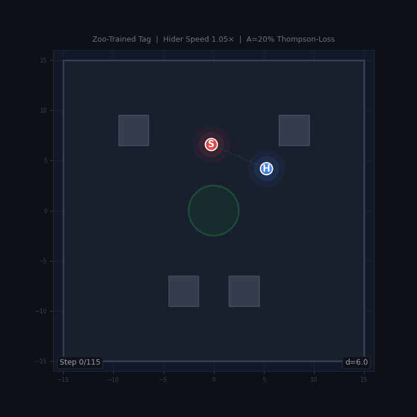
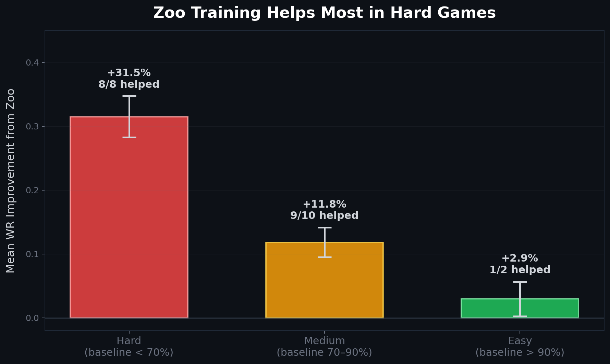
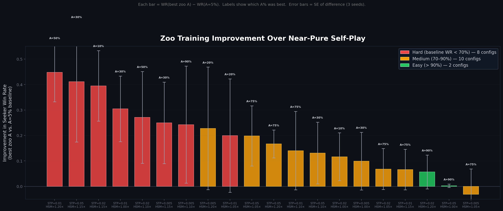
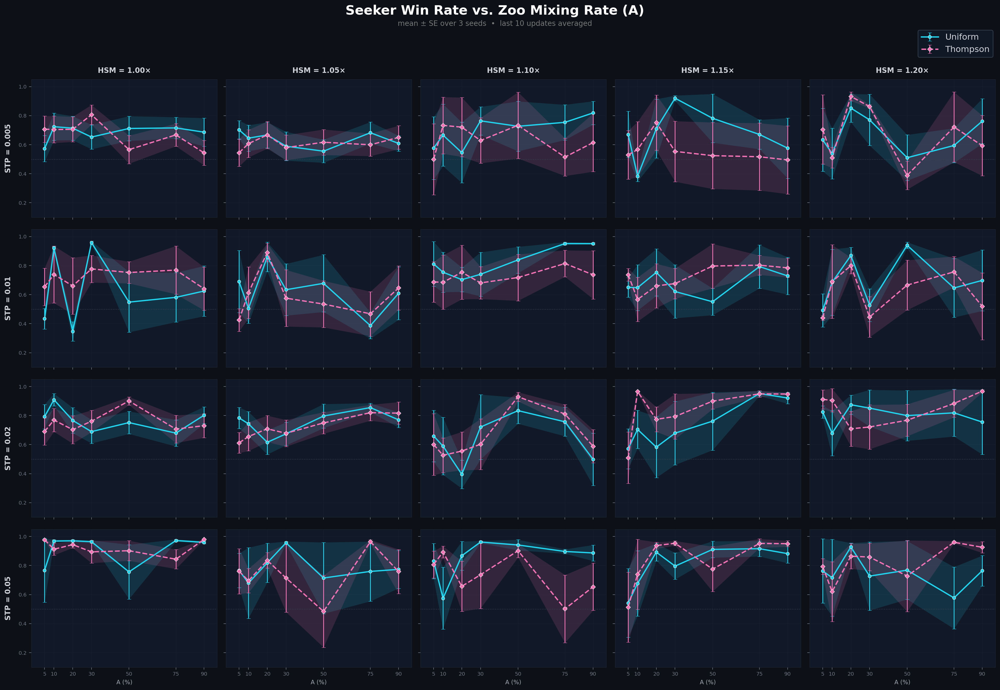
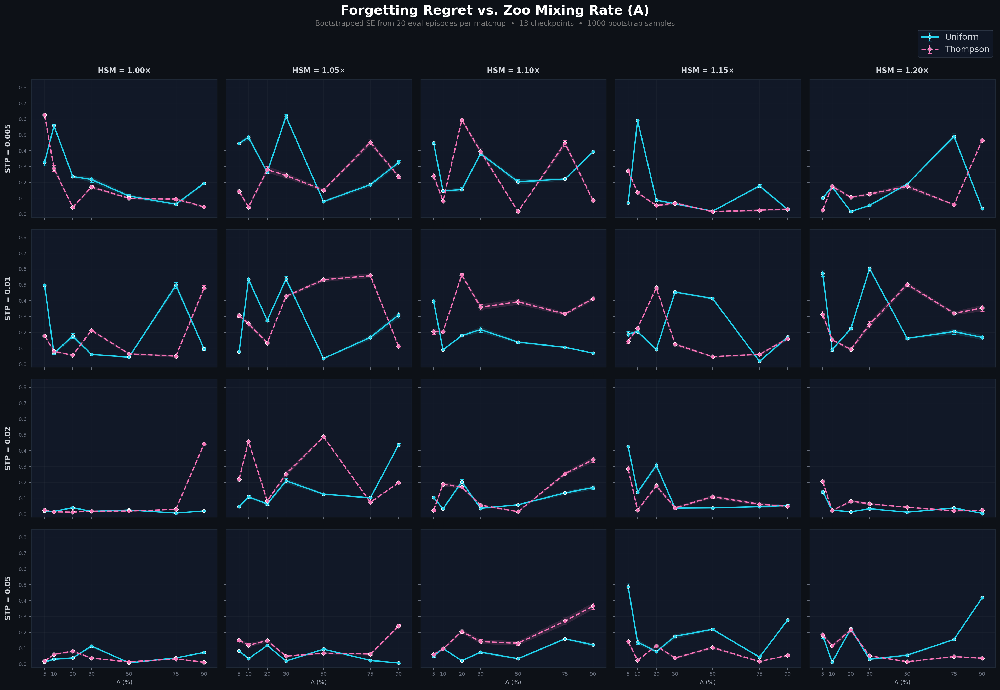

# AI Plays Tag

**Does training against past opponents make RL agents stronger?**

In self-play, agents often *forget* how to beat earlier strategies as they co-adapt with their current opponent. We investigate whether mixing in past opponents from a "zoo" of archived checkpoints can fix this — and find that **zoo training improved the seeker's win rate in 18 out of 20 game configurations, with the largest gains (+31 pp on average) in the hardest games.**

<p align="center">
  
  <br>
  <em>A zoo-trained seeker (red) chases a 15% faster hider (blue) through the four_corners arena.<br>
  Both agents were trained with PPO against a population of past opponents (A=30%, 10M timesteps).<br>
  This episode shows 134 steps of open-field pursuit ending in a tag — 0% corner time, 93% interior play.</em>
</p>

## The Game

Two agents compete in a bounded 2D arena with obstacles:

- **Seeker** (red) tries to catch the hider by closing within tagging distance
- **Hider** (blue) tries to survive until the time limit (200 steps)
- The arena contains rectangular obstacles that block movement and a central safe zone

Each agent observes its own position/velocity, the opponent's relative position, and **36 vision rays** that detect walls, obstacles, and the other agent. Actions are continuous 2D accelerations.

Two parameters control game difficulty:

| Parameter | Symbol | Effect |
|---|---|---|
| Seeker Time Penalty | **STP** | Per-step reward cost on the seeker — higher means more pressure to tag quickly |
| Hider Speed Multiplier | **HSM** | Hider speed relative to seeker — above 1.0 means the hider is faster |

We sweep 4 STP values (0.005, 0.01, 0.02, 0.05) and 5 HSM values (1.0, 1.05, 1.10, 1.15, 1.20) for **20 game configurations** ranging from easy to hard.

## The Research Question

In standard self-play, both agents train exclusively against each other's latest policy. This is efficient but fragile: the seeker can overfit to the current hider's strategy and lose the ability to beat earlier ones — a phenomenon called *catastrophic forgetting*.

**Zoo training** offers an alternative. The seeker maintains a "zoo" of archived hider checkpoints and trains against a mixture:

- **A%** of rollouts: play against a randomly sampled **past hider** from the zoo
- **(1-A)%** of rollouts: play against the **latest hider** (self-play)

The central question: **does zoo training actually help, and when does it help most?**

## Key Finding: Zoo Helps Most in Hard Games

<p align="center">
  
</p>

We compared the best zoo configuration (A > 5%) against a near-pure self-play baseline (A = 5%) for each of the 20 game configs:

- **Zoo helped in 18/20 configs** and hurt in 0/20
- **Hard games** (baseline win rate < 70%): zoo improved win rate by **+31.5 pp** on average, helping in all 8 configs
- **Medium games** (baseline 70–90%): **+11.8 pp**, helping in 9/10
- **Easy games** (baseline > 90%): **+2.9 pp** — the seeker already wins; zoo adds little

<p align="center">
  
  <br>
  <em>Win rate improvement for each game config (best zoo A vs. A=5% baseline), sorted by magnitude.<br>
  Labels show which A% was optimal. Error bars = SE of the difference across 3 seeds.</em>
</p>

The interpretation: in hard games, pure self-play gets stuck in co-adaptation cycles where the seeker overfits to the current hider. Training against diverse past hiders breaks this cycle. In easy games, the seeker wins regardless, so diversity adds negligible benefit.

## Detailed Results

### Win Rate vs. Zoo Mixing Rate

<p align="center">
  
  <br>
  <em>Seeker win rate vs. A for each game config. Rows = STP, columns = HSM.<br>
  Cyan = uniform sampling, pink = Thompson-loss sampling. Error bars = SE over 3 seeds.</em>
</p>

No single A value dominates — the optimal zoo fraction varies by game. Thompson-loss sampling (which prioritizes opponents that beat the agent) edges out uniform sampling slightly, winning in 11/20 configs.

### Forgetting Regret

We measure forgetting with the **Forgetting Regret (FR)** metric. For each training run, we pit every saved seeker checkpoint against every saved hider checkpoint in a round-robin gauntlet, producing a win-rate matrix. FR is the average amount the seeker has regressed from its historical peak against each hider:

```
FR = mean( running_max(W[k,j] for k <= i) - W[i,j] )
```

<p align="center">
  
  <br>
  <em>Forgetting Regret vs. A across game configs. Bootstrapped SE from 20 eval episodes per matchup.</em>
</p>

The hard games (top rows, STP = 0.005 and 0.01) show the highest and most variable forgetting. Easy games (bottom rows) have FR near zero regardless of A. Interestingly, higher A does not consistently reduce FR — the relationship is noisy and game-dependent.

## Experimental Design

The full sweep covers **2,800 training runs**:

```
20 game configs  (4 STP x 5 HSM)
 x 7 A values   (5%, 10%, 20%, 30%, 50%, 75%, 90%)
 x 2 sampling   (uniform, thompson_loss)
 x 10 seeds
 = 2,800 runs @ 10M timesteps each
```

All runs use the `four_corners` arena layout. The seeker trains against a hider zoo; the hider always faces the latest seeker. When sampling from the zoo, we compare two strategies:

- **Uniform**: select a past checkpoint uniformly at random
- **Thompson-loss**: Thompson Sampling biased toward opponents that *beat* the current agent

## Project Structure

```
trainer/
  tag_env.py              Vectorized 2D tag environment (3000+ steps/sec)
  ppo.py                  PPO agent with MLP policy/value networks
  train_zoo.py            Zoo-based population training
  train_selfplay.py       Pure self-play baseline

experiments/
  zoo_asweep_tasks.py     A-sweep SLURM task generator
  zoo_asweep_gauntlet.py  Checkpoint gauntlet + forgetting regret
  animate_zoo_sweep.py    Episode animation generator
  checkpoint_gauntlet.py  Cross-checkpoint evaluation
```

## Quick Start

### Prerequisites

Install [Pixi](https://pixi.sh) (manages Python 3.11 + PyTorch + all dependencies):

```bash
pixi install
```

### Train a zoo agent

```bash
# Quick test (100K steps, ~30 seconds)
pixi run python trainer/train_zoo.py --timesteps 100000

# Full training (10M steps, ~3 hours on CPU)
pixi run python trainer/train_zoo.py \
  --timesteps 10000000 \
  --latest-prob 0.7 \
  --sampling-strategy thompson_loss \
  --layout four_corners \
  --output-dir runs/my_experiment
```

Key arguments:
- `--latest-prob P`: probability of playing latest opponent (A = 1 - P)
- `--sampling-strategy {uniform,thompson,thompson_loss}`: zoo sampling method
- `--seeker-time-penalty`: per-step seeker penalty (e.g. -0.05)
- `--hider-speed-mult`: hider speed relative to seeker (e.g. 1.15)
- `--layout {empty,four_corners,central_cross,playground}`: arena layout

### Train with pure self-play

```bash
pixi run python trainer/train_selfplay.py --timesteps 1000000 --layout four_corners
```

### Reproduce the full sweep (SLURM)

```bash
sbatch run_zoo_asweep.sh                    # seeds 0-2 (840 tasks)
sbatch run_zoo_asweep_extra_seeds.sh        # seeds 3-9 batch 1 (980 tasks)
sbatch run_zoo_asweep_extra_seeds_b2.sh     # seeds 3-9 batch 2 (980 tasks)
sbatch run_zoo_asweep_gauntlet.sh           # forgetting regret gauntlets (280 tasks)
```

## Technical Details

### Environment
- **Arena**: 30x30 bounded area with configurable obstacle layouts
- **Observations**: position, velocity, role flags, 36 vision rays, safe zone state
- **Actions**: continuous 2D acceleration, clamped to [-1, 1]
- **Vectorized**: NumPy-batched across 64 parallel environments

### Training
- **Algorithm**: PPO with clipped surrogate objective
- **Networks**: 2-layer MLP (128 hidden, Tanh), separate policy and value heads
- **Two-phase rollout**: each update collects on-policy data for one role; the opponent uses a sampled zoo/latest policy
- **Hider zoo**: up to 50 archived checkpoints, updated every 50 training iterations

### Metrics
Training logs to CSV: seeker/hider rewards, win rates, episode lengths, policy/value losses, zoo sizes, and sampling rates. Forgetting regret computed via checkpoint gauntlets (20 eval episodes per matchup, 13 subsampled checkpoints).

## License

Open-source. Python, PyTorch, NumPy, Matplotlib.
