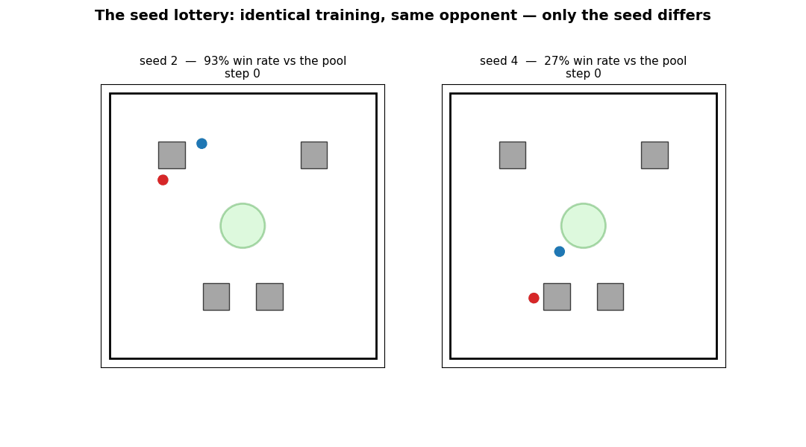
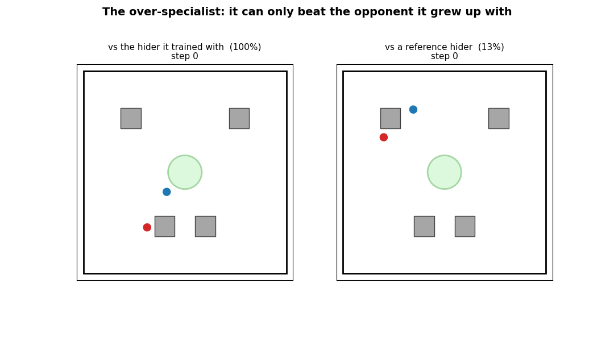
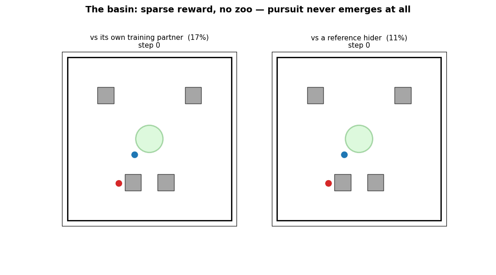
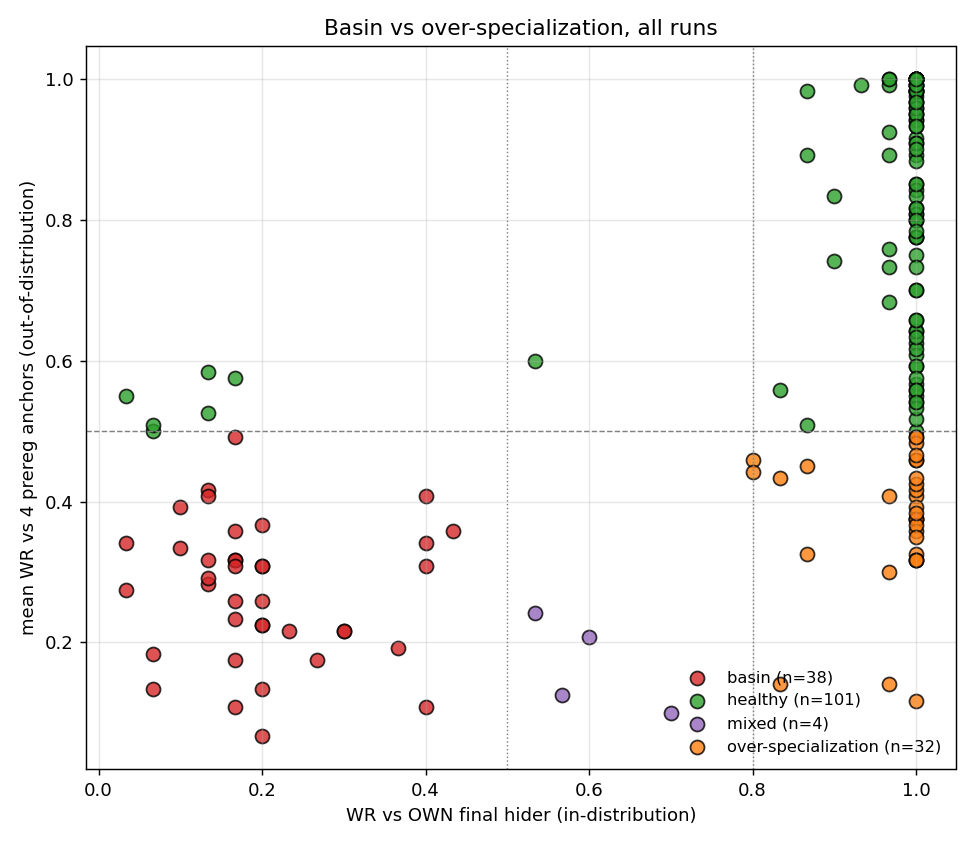
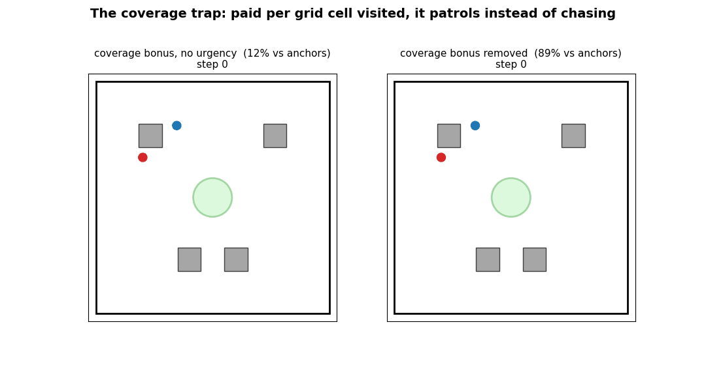
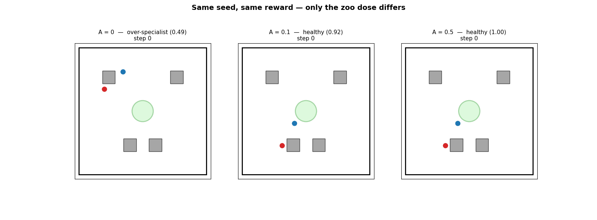
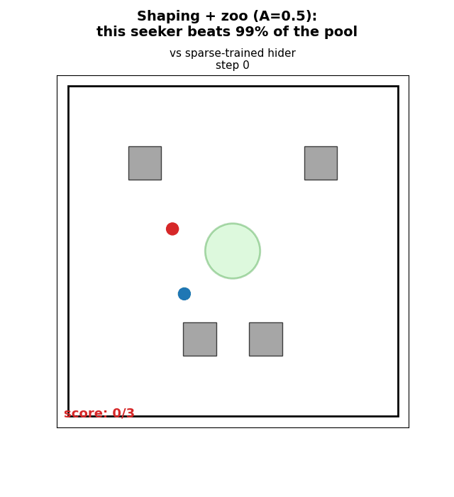
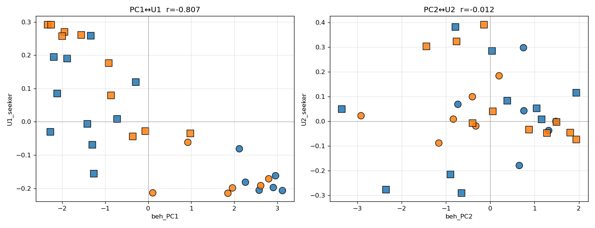

# AI Plays Tag

<p align="center">
  
  <br>
  <em>The strongest seeker vs the strongest hider from 616 trained agents — 10 rounds with live score.<br>
  Both are SAC agents from Optuna-optimized zoo training with reward shaping.</em>
</p>

Two RL agents learn to play tag in a 2D arena with obstacles. The **seeker** (red) tries to catch the **hider** (blue) before time runs out. We train agents with PPO and SAC across multiple paradigms — self-play, zoo training, reward shaping — and pit them against each other to find what actually matters.

The repo hosts two research arcs. The first found that **algorithm choice (SAC vs PPO) dominated everything we tried** in the cross-method gauntlet. The second — a pre-registered, 195-run factorial study — asked the question that arc left open: *what does reward shaping actually do in self-play?* The answer is the story below.

**[Entropy Ablation](https://kilojoules.github.io/AI-Plays-Tag/entropy_study/)** | **[Reward Shaping Study](https://kilojoules.github.io/AI-Plays-Tag/reward_shaping/)** | **[HPO & Zoo Mixing Study](https://kilojoules.github.io/AI-Plays-Tag/hpo_study/)** | **[Project Page](https://kilojoules.github.io/AI-Plays-Tag/)**

---

# What Reward Shaping Actually Buys You

*A story in five acts, from a [pre-registered factorial study](experiments/design_c_results.md) of reward shaping × opponent diversity in PPO self-play: 195 training runs (plus three 10M-step pilots), ~143,000 evaluation episodes, one certified result, and two ways to lose. Every agent below is a real checkpoint from the study; every number is from the population evaluations, not the episodes shown. Regenerate the animations with `experiments/animate_design_c_story.py`.*

The two reward functions being compared:

| | **R4 sparse** | **R7 kitchen sink** |
|---|---|---|
| terminal | ±10 tag, +6 survive | ±10 tag, +6 survive |
| seeker shaping | — | pursuit-distance gradient, escalating time pressure |
| hider shaping | — | distance terms, wall penalty, speed bonus, survival trickle |
| both roles | — | area-coverage bonus (paid per new grid cell visited) |

## Act I — The seed lottery

The two seekers below trained with **identical rewards (R7), hyperparameters, environment, and steps**. The only difference is the random seed. Both are chasing the *same* reference hider:

<p align="center">
  
</p>

Dense shaping doesn't just buy a better average seeker (+29pp win rate over sparse at A=0, +54pp with zoo training) — it buys a **lottery ticket**. Between-seed variance under R7 is 3–4× higher than under R4 (σ = 2.0 vs 0.65 log-odds, non-overlapping credible intervals); within the A=0 cell alone, seeds range from 22% to 99% against the same evaluation panel.

And the training curves show *nothing*. Every R7 seeker — the 99% ones and the 27% ones — reaches 88–96% win rate against its own training partner. In self-play, the win rate you watch during training measures performance against one co-evolving opponent, and it is not commensurable across runs. Policy quality only exists relative to a population.

## Act II — Two ways to lose

What does a losing ticket look like? Watch the same seeker play two opponents:

<p align="center">
  
</p>

This is the **over-specialist** — the shaped arm's characteristic failure. It didn't fail to learn; it learned the *wrong thing*: a perfect counter to the one hider it co-evolved with (100%), useless against anyone else (13%). Checkpoint diagnostics show these agents acquire genuine pursuit skill mid-training, then narrow onto their partner. In self-play, your opponent is part of your reward function.

The obvious remedy — drop the shaping — fails differently. This is the **basin**, the sparse arm's characteristic failure:

<p align="center">
  
</p>

Sparse reward, pure self-play: 14 of 20 seeds never learn pursuit *at all* — not even against their own training partner. Classifying all 175 runs by (population win rate, own-partner win rate) resolves the lottery into these two modes:

<p align="center">
  
</p>

**Sparse fails by basin. Shaped fails by over-specialization.** (A third, rarer mode — the *hider* winning the arms race — appears when the hider's speed advantage grows; see the HSM flank in the results doc.) The two main modes need different medicine — which is why the two remedies in this study interact instead of substituting.

## Act III — The trap is a reward term

Which shaping term makes over-specialists? Ablating them one at a time points at the **area-coverage bonus** — a reward per new cell of a 6×6 grid visited, added to encourage exploration. Watch a seeker trained with the bonus (and without the escalating time pressure that appears to counteract it — that interaction is directionally consistent but not statistically certified):

<p align="center">
  
</p>

The left seeker sweeps straight past a hider it should be chasing. Interestingly, it is *not* farming coverage at eval time — we measured exactly what the bonus pays, and the failed seeker visits only 7.7 of 36 grid cells per episode, covering *less* new area per step than the healthy hunter on the right (6.3 vs 9.7 cells per 100 steps; `--coverage-stats`). The bonus does its damage during *training*: it rewards a policy for something other than tracking the opponent, and self-play never corrects the drift because the co-evolving partner is beatable anyway. The causal evidence is the ablation: remove the coverage bonus and the cell goes **15/15 healthy** with the best mean of any cell (0.82); remove coverage *and* urgency and most of the between-seed variance disappears with it (σ: 1.7–2.1 → 0.95).

One caveat the follow-up experiments added: against a *sparse-trained* (narrower) partner, over-specialists re-emerge even without coverage. Partner narrowness enables the trap; coverage amplifies it.

## Act IV — Opponent diversity is a dose

Zoo training replaces the live training partner, with probability A, by a random snapshot from the partner's history. Here is the *same seed* — same initialization, same reward — at three doses:

<p align="center">
  
</p>

At A=0 this seed loiters near the safe zone instead of engaging the hider in the corner — an over-specialist (0.49 against the panel, 1.00 against its own partner). At A=0.1 it generalizes (0.92). At A=0.5 it is flawless (1.00). Across cells, the dose–response is mode-specific: **basins vanish by A ≥ 0.1** (a small dose breaks the never-learn equilibrium), while **over-specialization shrinks ~3× by A = 0.5** but keeps a tail — un-narrowing a policy takes sustained diversity. A behavioral panel of the final hiders shows A works through the *history* the seeker is exposed to, not by making the final partner more diverse.

## Act V — Complements, certified

We pre-registered the natural hypothesis: zoo training *substitutes* for shaping (dense reward's advantage should shrink as A grows). The data certified the opposite, after a pre-registered power extension to n=20 seeds per cell:

> **Shaping × zoo interaction: β = +2.05 log-odds, 95% CrI [+0.72, +3.45], P(>0) = 0.999.**
> On the win-rate scale: zoo training adds **+21pp under dense shaping** [+5, +37] and nothing under sparse (β_A ≈ 0).

They are **complements**: shaping is what makes opponent diversity useful (a basin learns nothing from diverse opponents), and diversity is what de-risks shaping (it's the anti-over-specialization treatment). Note the study offers *two* fixes for the lottery — removing the coverage term is the reward-side fix (Act III), zoo dose is the training-side fix — and they attack the same failure mode from different ends. Among the pre-registered cells, shaped + zoo is the strongest and safest (mean 0.81; over-specialists thinned to 2/20, not zero — the lottery is tamed, not abolished):

<p align="center">
  
</p>

Two follow-ups pin down the causality. **Whose reward?** In self-play the "reward" factor changes the opponent's training too — so we ran mixed-reward cells (shaped seeker, sparse hider). Seeker-side shaping alone reproduces the main effect (certified), the interaction, and the variance inflation; toggling hider-side shaping does nothing. The effects live in the agent's own reward, not opponent quality. **Why the variance?** A behavioral fingerprint of all 32 gauntlet policies correlates with the outcome skill axis at |r| = 0.81 — strong seekers all converge on the *same* strategy. The lottery is **exploration variance**: the seed decides who finds the strategy, not which of several strategies you get.

<p align="center">
  
</p>

## Why you can trust this

The study was pre-registered before data collection (v1–v2), amended in the open when SAC failed its pilot gate, and power-extended under a frozen fixed-n protocol (v3). It then survived a full adversarial review — three independent audit passes over the code, statistics, and pre-registration chain — which found real bugs (a role-indexing bug in behavioral features, a GAE off-by-one shared by all runs, a vacuous adaptive-evaluation mechanism) and real protocol deviations, all disclosed in the [errata section](experiments/design_c_results.md) with bounding experiments showing none of them drive the headline claims. The confirmatory result also survives an overdispersion-robust refit (+2.40 [+0.77, +4.05]). Raw evaluation data ships in this repo under `experiments/results/design_c/`.

One connection to the repo's first arc: SAC's entropy bootstrap makes sparse reward workable (R4-sparse SAC was among our best agents), while PPO's sparse runs basin. Both stories are about the same thing — *early exploration determines final strength* — SAC buys it with entropy, PPO has to buy it with reward shaping, and then pay the over-specialization tax that shaping incurs.

---

## The Game

A 30x30 arena with 4 obstacles and a central safe zone. Each agent observes position, velocity, the opponent's relative state, and **36 vision rays** (120 FOV). Actions are continuous 2D accelerations. Episodes last 200 steps; the hider has a speed advantage (up to 20% faster).

Two parameters control difficulty:

| Parameter | Effect |
|---|---|
| **Seeker Time Penalty (STP)** | Per-step cost on the seeker — higher = more pressure to tag quickly |
| **Hider Speed Multiplier (HSM)** | Hider speed relative to seeker — above 1.0 = the hider is faster |

---

## The A-Parameter Hypothesis

In standard self-play, both agents train against each other's latest policy. This is efficient but fragile — the seeker can overfit to the current hider and forget how to beat earlier strategies (*catastrophic forgetting*).

**Zoo training** offers an alternative. The seeker maintains a "zoo" of archived hider checkpoints and trains against a mixture:

- With probability **A**: play against a randomly sampled **past hider** from the zoo
- With probability **1-A**: play against the **latest hider** (self-play)

We hypothesized that zoo mixing would reduce forgetting and produce stronger agents. We tested this across multiple games:

| Game | Forgetting? | Zoo helps? | Why |
|------|:-----------:|:----------:|-----|
| [RPS](https://github.com/kilojoules/RPS_RL) | Cycling | Yes | Nash *is* best response to any mix; zoo breaks co-adaptation |
| [Kuhn Poker](https://github.com/kilojoules/Kuhn-Poker-RL) | Absent | No | Best response to random is exploitative, not Nash |
| **Tag** (this repo) | Present | **Complicated** | Zoo helps PPO within-run, but the effect vanishes in cross-evaluation |

### Initial result: zoo helps (PPO, within-run evaluation)

With PPO and default hyperparameters, zoo training improved seeker win rate in **20/20 game configs**, with the largest gains (+39 pp average) in the hardest games:

<p align="center">
  
</p>

### Revised result: zoo doesn't actually matter

When we [re-evaluated with Optuna-optimized hyperparameters](https://kilojoules.github.io/AI-Plays-Tag/hpo_study/) and cross-config gauntlet testing (agents playing opponents they *didn't* train against), the zoo effect disappeared:

- **A=0 (pure self-play) performs identically to A=1 (full zoo)** in cross-evaluation
- **SAC dominates PPO 95-to-2** in cross-algorithm play, regardless of A
- SAC exhibits massive forgetting (FR=0.36) but still produces the strongest agents

The initial zoo improvement was an artifact of within-run evaluation — the zoo helped the seeker beat *its own* hider, but not arbitrary opponents.

> **How does "zoo doesn't matter" square with the certified +21pp zoo effect in the story above?** Different regimes, and — more importantly — different questions. This null compared A=0 to A=1 (full zoo replacement) with Optuna-tuned hyperparameters in a SAC-dominated cross-algorithm gauntlet, and asked about the zoo's *main effect*. The pre-registered study compared A=0 to A=0.5 in PPO and found the zoo effect exists only in *interaction* with dense reward shaping: +21pp for shaped agents, nothing for sparse ones (β_A ≈ 0). Averaged over reward conditions — which is what a main-effects search does — the interaction washes out to roughly the null this section reports. The earlier analysis wasn't wrong; it was asking a question whose answer is "it depends," and couldn't see the "depends."

---

## Cross-Method Gauntlet

To settle which training method produces the best opponents, we ran a [cross-method gauntlet](https://kilojoules.github.io/AI-Plays-Tag/reward_shaping/#cross-method-gauntlet): 616 agents from 6 training paradigms, top 3 per method selected, 27x27 all-vs-all evaluation:

<p align="center">
  
</p>

| Method | Seeker | Hider | Combined |
|--------|-------:|------:|---------:|
| **FR v2 / SAC** | 72.6% | 89.1% | **80.9%** |
| **Reward / SAC** | 71.9% | 89.7% | **80.8%** |
| **FR / SAC** | 71.6% | 84.4% | **78.0%** |
| Selfplay / PPO | 51.6% | 50.5% | 51.0% |
| Reward / PPO | 47.0% | 45.9% | 46.4% |
| Zoo / PPO | 23.9% | 32.5% | 28.2% |

SAC methods cluster at 78-81% combined strength. All PPO and zoo methods sit below 51%. The training paradigm (self-play, zoo, reward presets) barely matters compared to the algorithm choice.

---

## Entropy Temperature Ablation

The [entropy ablation study](https://kilojoules.github.io/AI-Plays-Tag/entropy_study/) tests whether SAC's entropy bonus is the mechanism behind its dominance. We trained SAC on sparse rewards (no shaping) under three entropy conditions:

<p align="center">
  
</p>

Auto-tuned alpha starts at ~0.57 and **crashes to ~0.003 within 500K steps**. The competitive arms race plays out *after* entropy has already decayed to near-zero.

| Condition | Seeker | Hider survival | Combined |
|-----------|-------:|---------------:|---------:|
| **Auto-tuned** (settles to ~0.003) | 39.3% | 74.9% | **57.1%** |
| No entropy (alpha=0) | 30.0% | 62.0% | 46.0% |
| Fixed alpha=0.1 | 1.5% | 18.4% | 9.9% |

**Fixed moderate entropy is catastrophically worse than no entropy at all.** The mechanism is not sustained exploration — it's a brief high-entropy bootstrapping phase that must naturally terminate. Auto-tuning discovers this schedule; a fixed coefficient prevents it.

Across all 8 reward presets, the learned entropy schedule is nearly identical — the reward function doesn't affect it. With SAC, R4 Sparse (no shaping) ranks 3rd out of 8, confirming that reward engineering is largely unnecessary when the entropy schedule is correct.

---

## The First Reward-Shaping Sweep (prologue to the story above)

Before the pre-registered study, an exploratory [reward shaping sweep](https://kilojoules.github.io/AI-Plays-Tag/reward_shaping/) tested 8 reward presets across PPO and SAC (48 training runs, 5M timesteps each). Its two extremes — R4 sparse and R7 kitchen sink — became the factor levels of the factorial study:

- **Sparse rewards fail for PPO** but SAC's entropy bonus compensates — R4 Sparse PPO is the worst agent (7%), R4 Sparse SAC is the best hider (87% survival)
- **Anti-degenerate shaping matters most** — wall proximity penalties and speed bonuses prevent corner camping more effectively than increasing reward magnitude
- **Escalating time pressure** (R5) creates the most dynamic pursuit behavior
- **Kitchen sink is not optimal** — combining all shaping terms creates conflicting gradients

<div align="center">
<table>
<tr>
<td align="center"><b>R0 Baseline (PPO)</b><br>No shaping = passive play</td>
<td align="center"><b>R5 Escalating (SAC)</b><br>Dynamic pursuit with urgency</td>
</tr>
<tr>
<td></td>
<td></td>
</tr>
</table>
</div>

---

## Quick Start

Install [Pixi](https://pixi.sh), then:

```bash
pixi install

# Self-play training (1M steps, ~5 min)
pixi run python trainer/train_selfplay.py --timesteps 1000000 --layout four_corners

# Zoo training (10M steps, ~3 hours)
pixi run python trainer/train_zoo.py \
  --timesteps 10000000 \
  --latest-prob 0.7 \
  --sampling-strategy thompson_loss \
  --layout four_corners

# SAC self-play
pixi run python trainer/train_selfplay_sac.py --timesteps 5000000 --layout four_corners
```

Key arguments:
- `--latest-prob P`: probability of playing latest opponent (A = 1 - P)
- `--sampling-strategy {uniform,thompson,thompson_loss}`: zoo sampling method
- `--hider-speed-mult`: hider speed relative to seeker (e.g. 1.15)
- `--layout {empty,four_corners,central_cross,playground}`: arena layout

## Project Structure

```
trainer/
  tag_env.py              Vectorized 2D tag environment (NumPy, 3000+ steps/sec)
  ppo.py / sac.py         PPO and SAC agents (PyTorch)
  train_selfplay.py       Self-play training (PPO)
  train_selfplay_sac.py   Self-play training (SAC)
  train_zoo.py            Zoo-based training (PPO)
  train_zoo_sac.py        Zoo-based training (SAC)

experiments/
  reward_presets.py        8 named reward configurations (R0-R7)
  cross_method_gauntlet.py Cross-method evaluation (616 agents, 9 methods)
  reward_gauntlet.py       Within-preset cross-evaluation
  plot_cross_method.py     Generate gauntlet heatmaps and strength plots
  fr_sweep_tasks.py        SLURM task generators for large sweeps
  design_c_*.py            Pre-registered shaping x zoo study: task tables,
                           gauntlet, anchor-panel evals, GLMM/MCMC fits,
                           trajectory analysis (see design_c_results.md)
  animate_design_c_story.py  README story animations (docs/design_c/)
```

## Total Compute

Over 1,500 training runs across all experiments:

| Experiment | Runs | Steps each | Total |
|-----------|-----:|----------:|------:|
| Zoo A-sweep | 600 | 10M | 6B |
| Self-play sweep | 20 | 10M | 200M |
| Reward shaping | 48 | 5M | 240M |
| FR sweep (v1 + v2) | 300 | 5M | 1.5B |
| HPO (Optuna) | 200 | 1M | 200M |
| Entropy ablation | 33 | 5M | 165M |
| Design C (prereg factorial + ablations + deconfound) | 195 + 3 pilots | 5M (pilots 10M) | ~1B |

All evaluated via cross-config gauntlets (20-50 episodes per matchup).

## Related Projects

- **[RPS_RL](https://github.com/kilojoules/RPS_RL)** — Rock-Paper-Scissors testbed. Zoo sampling breaks co-adaptation cycles. Establishes the A-parameter hypothesis.
- **[Kuhn-Poker-RL](https://github.com/kilojoules/Kuhn-Poker-RL)** — Negative result: zoo sampling *hurts* in Kuhn Poker because the best response to weak opponents is exploitative, not Nash.
- **[REDKWEEN](https://github.com/kilojoules/REDKWEEN)** — Automated LLM red teaming via self-play. Zoo sampling for adversary diversity is an open question.
- **[Adversarial Self-Play for Wind Farm Control](https://julianquick.com/ML/adversarial.html)** — The original motivation: comparing training topologies for robust controllers.

## License

Open-source. Python, PyTorch, NumPy, Matplotlib.
