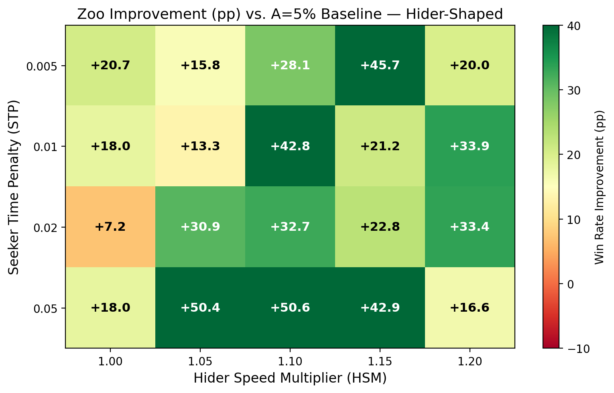
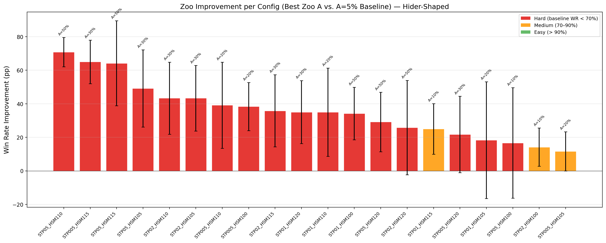
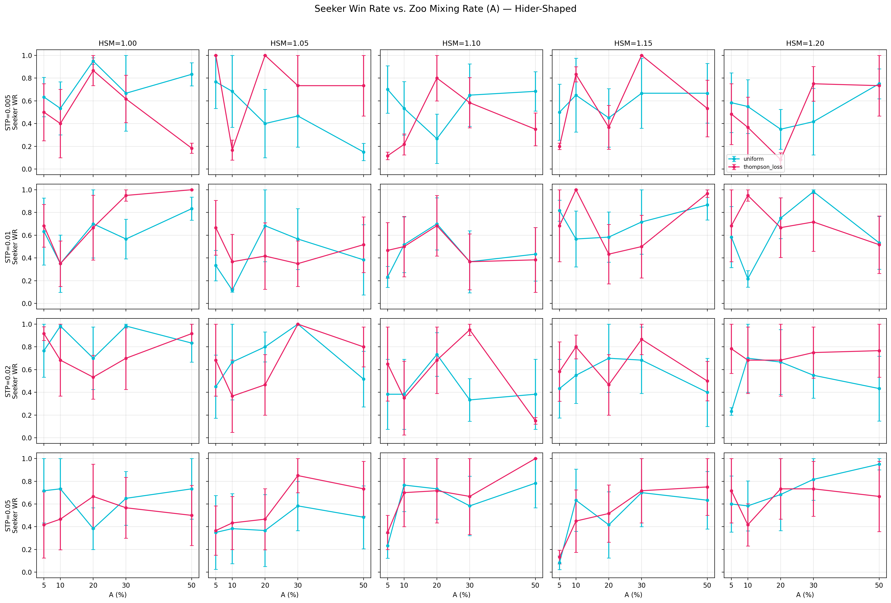
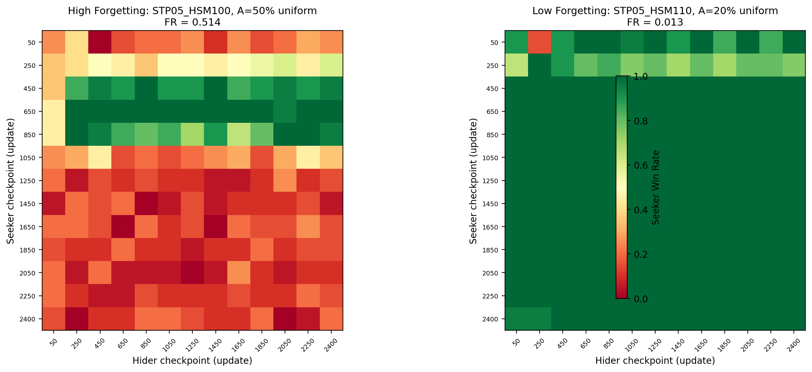
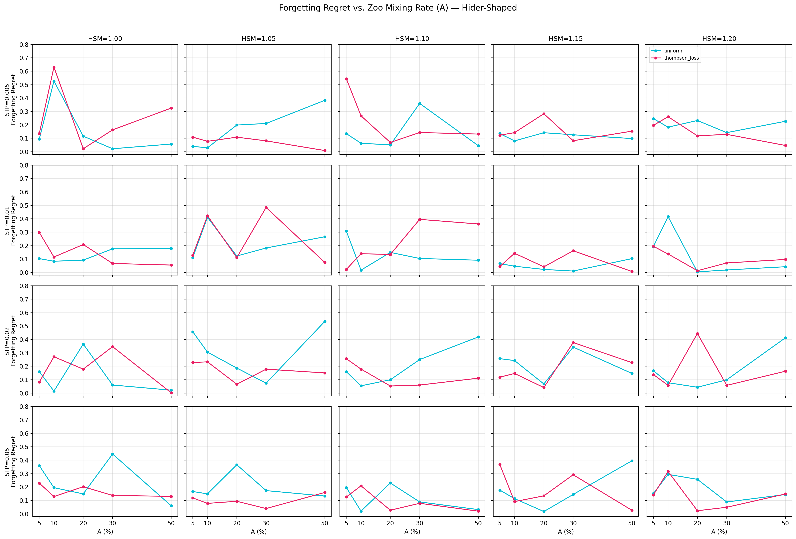
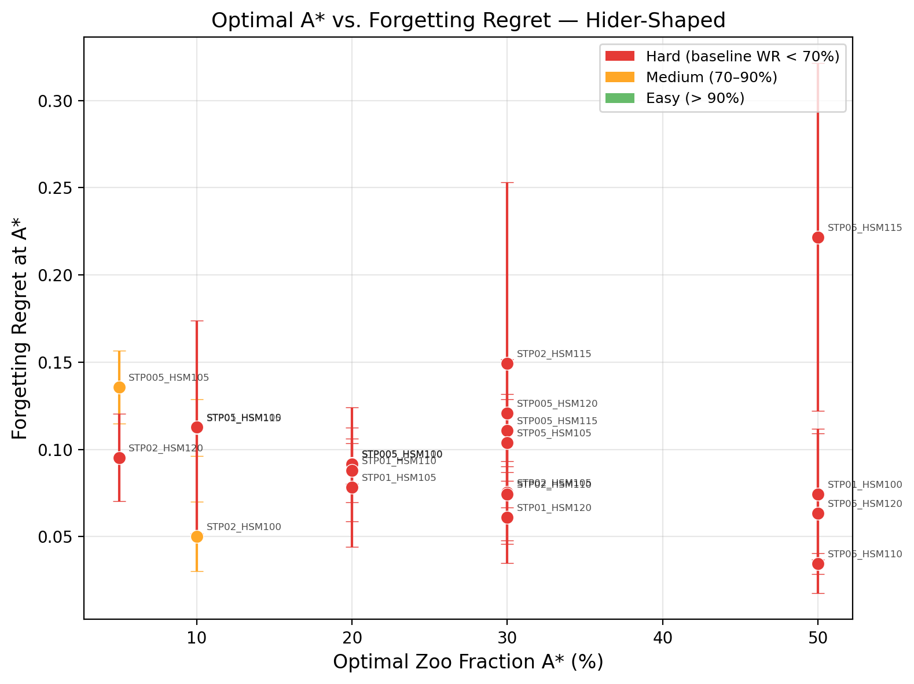

# AI Plays Tag

**[HPO & Zoo Mixing Study](https://kilojoules.github.io/AI-Plays-Tag/hpo_study/)** | **[Reward Shaping Study](https://kilojoules.github.io/AI-Plays-Tag/reward_shaping/)** | **[Project Page](https://kilojoules.github.io/AI-Plays-Tag/)**

**Does training against past opponents make RL agents stronger?**

In self-play, agents often *forget* how to beat earlier strategies as they co-adapt with their current opponent. We investigate whether mixing in past opponents from a "zoo" of archived checkpoints can fix this — and find that **zoo training improved the seeker's win rate in all 20 game configurations, with the largest gains (+39 pp on average) in the hardest games.**

<p align="center">
  
  <br>
  <em>The project's strongest seeker (FR v2 R5 Escalating SAC, 77% win rate) vs strongest hider (FR v2 R3 Both-Shaped SAC, 93% survival rate) — 10 rounds with live score. Both agents emerged from Optuna-optimized zoo training with reward shaping. Four_corners arena, HSM=1.15.</em>
</p>

## The Game

Two agents compete in a bounded 2D arena with obstacles:

- **Seeker** (red) tries to catch the hider by closing within tagging distance
- **Hider** (blue) tries to survive until the time limit (200 steps)
- The arena contains rectangular obstacles that block movement and a central safe zone

Each agent observes its own position/velocity, the opponent's relative position, and **36 vision rays** that detect walls, obstacles, and the other agent. Actions are continuous 2D accelerations.

Two parameters control game difficulty:

| Parameter | Symbol | Effect |
|---|---|---|
| Seeker Time Penalty | **STP** | Per-step reward cost on the seeker — higher means more pressure to tag quickly |
| Hider Speed Multiplier | **HSM** | Hider speed relative to seeker — above 1.0 means the hider is faster |

We sweep 4 STP values (0.005, 0.01, 0.02, 0.05) and 5 HSM values (1.0, 1.05, 1.10, 1.15, 1.20) for **20 game configurations** ranging from easy to hard.

## The A Parameter

The **A parameter** controls how often an agent trains against historical opponents from a "zoo" of archived checkpoints versus the latest opponent:

- **A = 0 (self-play)**: Always train against the latest opponent. No zoo. Use `train_selfplay.py`.
- **A in (0, 1) (zoo training)**: Each rollout samples a past opponent from the zoo with probability A, or plays the latest opponent with probability 1 − A.
- **A near 1**: Almost always sample from the zoo. Approaches Synthetic Self-Play (SSP).
- **A >= 1**: Invalid / not meaningful.

The command-line flag `--latest-prob` is the complement: `latest_prob = 1 − A`. This is a legacy naming convention.

**Arms Race** is a separate concept (not a value of A): sequential iteration where protagonist *n* trains only against adversary *n*−1 and each generation discards all prior opponents. See [adversarial self-play for wind farm control](https://julianquick.com/ML/adversarial.html) for a comparison of Arms Race, SSP, and Self-Play topologies.

### When does zoo sampling help?

Zoo sampling helps when **catastrophic forgetting** is present — when past adversaries perform better against later protagonists than later adversaries do. The structural test: does Nash equilibrium coincide with the best response to weak/random opponents? If yes, zoo helps. If no, zoo hurts.

| Game | Forgetting? | Zoo helps? | A* | Why |
|------|:-----------:|:----------:|:--:|-----|
| [RPS](https://github.com/kilojoules/RPS_RL) | Cycling (not forgetting) | Yes | 0.05–0.9 (dynamic) | Nash *is* best response to any mix; zoo breaks co-adaptation cycles |
| [Kuhn Poker](https://github.com/kilojoules/Kuhn-Poker-RL) | Absent | No | 0 (self-play) | Best response to random is exploitative, not Nash; zoo reinforces bad habits |
| **Tag** (this repo) | Present | **Yes** | Config-dependent | Hard games show real skill regression; zoo provides corrective curriculum |
| [LLM Red Teaming](https://github.com/kilojoules/REDKWEEN) | Open question | Open question | Untested | Defense dominates in self-play; zoo may help adversary diversity |

## The Research Question

In standard self-play, both agents train exclusively against each other's latest policy. This is efficient but fragile: the seeker can overfit to the current hider's strategy and lose the ability to beat earlier ones — a phenomenon called *catastrophic forgetting*.

**Zoo training** offers an alternative. The seeker maintains a "zoo" of archived hider checkpoints and trains against a mixture:

- **A%** of rollouts: play against a randomly sampled **past hider** from the zoo
- **(1-A)%** of rollouts: play against the **latest hider** (self-play)

The central question: **does zoo training actually help, and when does it help most?**

## The A Parameter

The zoo mixing rate **A** controls how often the seeker trains against past opponents vs. the current one. At A=5% (near-pure self-play), almost all training is against the latest hider. At A=50%, half of all rollouts use a randomly sampled past hider from the zoo.

Higher A increases opponent diversity but reduces exposure to the latest (and presumably strongest) hider strategy. The optimal A depends on the game — harder games tend to benefit from more diversity, while easy games see little effect.

We sweep A across 5%, 10%, 20%, 30%, and 50% for each of the 20 game configurations.

## Key Finding: Zoo Helps Most in Hard Games

<p align="center">
  
</p>

We compared the best zoo configuration (A > 5%) against a near-pure self-play baseline (A = 5%) for each of the 20 game configs:

- **Zoo helped in 20/20 configs** and hurt in 0/20
- **Hard games** (baseline win rate < 70%): zoo improved win rate by **+39.1 pp** on average across all 17 configs
- **Medium games** (baseline 70–90%): **+16.9 pp** across 3 configs

<p align="center">
  
  <br>
  <em>Win rate improvement for each game config (best zoo A vs. A=5% baseline), sorted by magnitude.<br>
  Labels show which A% was optimal. Win rates measured via gauntlet evaluation (20 episodes per matchup). Error bars = SE across 3 training seeds.</em>
</p>

The interpretation: in hard games, pure self-play gets stuck in co-adaptation cycles where the seeker overfits to the current hider. Training against diverse past hiders breaks this cycle. With hider reward shaping (distance-change incentives), the hider learns stronger evasion, making games harder overall — which amplifies the benefit of zoo training.

## Detailed Results

### Win Rate vs. Zoo Mixing Rate

<p align="center">
  
  <br>
  <em>Seeker win rate vs. A for each game config. Rows = STP, columns = HSM.<br>
  Cyan = uniform sampling, pink = Thompson-loss sampling. Win rates from gauntlet evaluation (final seeker vs. final hider, 20 episodes). Error bars = SE across 3 training seeds.</em>
</p>

No single A value dominates — the optimal zoo fraction varies by game. Thompson-loss sampling (which prioritizes opponents that beat the agent) edges out uniform sampling slightly, winning in 11/20 configs.

### Forgetting Regret

We measure forgetting with the **Forgetting Regret (FR)** metric. For each training run, we pit every saved seeker checkpoint against every saved hider checkpoint in a round-robin gauntlet, producing a win-rate matrix W where W[i,j] is the win rate of seeker checkpoint i against hider checkpoint j.

<p align="center">
  
  <br>
  <em>Win-rate matrices from two runs. Left: high forgetting — the seeker learns to beat early hiders (green top-left) but loses that ability later (red bottom-left). Right: low forgetting — the seeker maintains high win rates across all hider checkpoints. Each cell = 20 eval episodes.</em>
</p>

FR captures how much the seeker has regressed from its historical peak against each hider:

```
FR = mean( running_max(W[k,j] for k <= i) - W[i,j] )
```

<p align="center">
  
  <br>
  <em>Forgetting Regret vs. A across game configs. Computed from checkpoint gauntlet (13 subsampled checkpoints, 20 eval episodes per matchup). Error bars = SE across 3 training seeds.</em>
</p>

The hard games (top rows, STP = 0.005 and 0.01) show the highest and most variable forgetting. Easy games (bottom rows) have FR near zero regardless of A. Interestingly, higher A does not consistently reduce FR — the relationship is noisy and game-dependent.

### Optimal A vs. Forgetting Regret

<p align="center">
  
  <br>
  <em>Each point is one game config, plotted at its optimal zoo fraction (A*) and the corresponding forgetting regret. Color indicates baseline difficulty. Gauntlet evaluation (20 episodes per matchup), error bars = SE across 3 training seeds.</em>
</p>

The scatter shows no clear trade-off between optimal zoo mixing and forgetting — A* varies widely (5–50%) without a consistent relationship to FR. This suggests that the optimal A is driven more by the game's difficulty structure than by forgetting dynamics.

## Update: Hyperparameter Optimization & Revised A-Sweep

Our [HPO & Zoo Mixing Study](https://kilojoules.github.io/AI-Plays-Tag/hpo_study/) re-examined the A-parameter hypothesis with Optuna-optimized hyperparameters (200 HPO trials) and a cross-config gauntlet (2,500 matchups). Key findings:

- **Zoo mixing (A) does not produce stronger agents.** A=0 (pure self-play) performs identically to A=1 (full zoo) in cross-evaluation gauntlet.
- **SAC dominates PPO 95-to-2** in cross-algorithm play, despite appearing to "fail" during training (15% SWR). Training balance is a poor proxy for agent quality.
- **SAC exhibits massive forgetting** (FR=0.36, every run) but still produces the strongest agents. The self-play oscillation may be beneficial.
- **Algorithm choice matters more** than zoo parameters, reward presets, or hyperparameter tuning.

## Experimental Design

The full sweep covers **600 training runs**:

```
20 game configs  (4 STP x 5 HSM)
 x 5 A values   (5%, 10%, 20%, 30%, 50%)
 x 2 sampling   (uniform, thompson_loss)
 x 3 seeds
 = 600 runs @ 10M timesteps each
```

The hider receives additional reward shaping: a distance-change reward (`hider_dist_reward=0.14`) and an absolute-distance reward (`hider_abs_dist_reward=0.1`) that encourage active evasion rather than passive hiding.

All runs use the `four_corners` arena layout. The seeker trains against a hider zoo; the hider always faces the latest seeker. When sampling from the zoo, we compare two strategies:

- **Uniform**: select a past checkpoint uniformly at random
- **Thompson-loss**: Thompson Sampling biased toward opponents that *beat* the current agent

## Project Structure

```
trainer/
  tag_env.py              Vectorized 2D tag environment (3000+ steps/sec)
  ppo.py                  PPO agent with MLP policy/value networks
  train_zoo.py            Zoo-based population training
  train_selfplay.py       Pure self-play baseline

experiments/
  zoo_hider_shaped_tasks.py      A-sweep SLURM task generator (hider-shaped)
  zoo_hider_shaped_gauntlet.py   Checkpoint gauntlet + forgetting regret
  plot_zoo_hider_shaped.py       Generate all README plots
  animate_zoo_sweep.py           Episode animation generator
  checkpoint_gauntlet.py         Cross-checkpoint evaluation
```

## Quick Start

### Prerequisites

Install [Pixi](https://pixi.sh) (manages Python 3.11 + PyTorch + all dependencies):

```bash
pixi install
```

### Train a zoo agent

```bash
# Quick test (100K steps, ~30 seconds)
pixi run python trainer/train_zoo.py --timesteps 100000

# Full training (10M steps, ~3 hours on CPU)
pixi run python trainer/train_zoo.py \
  --timesteps 10000000 \
  --latest-prob 0.7 \
  --sampling-strategy thompson_loss \
  --layout four_corners \
  --output-dir runs/my_experiment
```

Key arguments:
- `--latest-prob P`: probability of playing latest opponent (A = 1 - P)
- `--sampling-strategy {uniform,thompson,thompson_loss}`: zoo sampling method
- `--seeker-time-penalty`: per-step seeker penalty (e.g. -0.05)
- `--hider-speed-mult`: hider speed relative to seeker (e.g. 1.15)
- `--layout {empty,four_corners,central_cross,playground}`: arena layout

### Train with pure self-play

```bash
pixi run python trainer/train_selfplay.py --timesteps 1000000 --layout four_corners
```

### Reproduce the full sweep (SLURM)

```bash
sbatch run_zoo_hider_shaped.sh              # training sweep (600 tasks)
sbatch run_zoo_hider_shaped_gauntlet.sh     # forgetting regret gauntlets (200 tasks)
pixi run python experiments/plot_zoo_hider_shaped.py  # generate all plots
```

## Technical Details

### Environment
- **Arena**: 30x30 bounded area with configurable obstacle layouts
- **Observations**: position, velocity, role flags, 36 vision rays, safe zone state
- **Actions**: continuous 2D acceleration, clamped to [-1, 1]
- **Vectorized**: NumPy-batched across 64 parallel environments

### Training
- **Algorithm**: PPO with clipped surrogate objective
- **Networks**: 2-layer MLP (128 hidden, Tanh), separate policy and value heads
- **Two-phase rollout**: each update collects on-policy data for one role; the opponent uses a sampled zoo/latest policy
- **Hider zoo**: up to 50 archived checkpoints, updated every 50 training iterations

### Metrics
Training logs to CSV: seeker/hider rewards, win rates, episode lengths, policy/value losses, zoo sizes, and sampling rates. Forgetting regret computed via checkpoint gauntlets (20 eval episodes per matchup, 13 subsampled checkpoints).

## Related Projects

This experiment is part of a series investigating zoo sampling and gauntlet-style evaluation across different games:

- **[RPS_RL](https://github.com/kilojoules/RPS_RL)** — Cheap testbed using Rock-Paper-Scissors. Zoo sampling breaks co-adaptation cycles and PPO benefits more than buffered agents, but heavy zoo degrades over time. Establishes the A-parameter hypothesis.
- **[Kuhn-Poker-RL](https://github.com/kilojoules/Kuhn-Poker-RL)** — Negative result: every RPS finding inverts in Kuhn Poker. Zoo sampling *hurts* because the best response to weak opponents is exploitative, not Nash. Reveals the catastrophic forgetting prerequisite.
- **[REDKWEEN](https://github.com/kilojoules/REDKWEEN)** — Automated LLM red teaming via self-play. A 1B adversary discovers real jailbreak strategies, but defense always wins in self-play. Zoo sampling for adversary diversity is an open question.
- **[Adversarial Self-Play for Wind Farm Control](https://julianquick.com/ML/adversarial.html)** — The original motivation: comparing Arms Race, SSP, and Self-Play training topologies for robust wind farm controllers.

## License

Open-source. Python, PyTorch, NumPy, Matplotlib.
