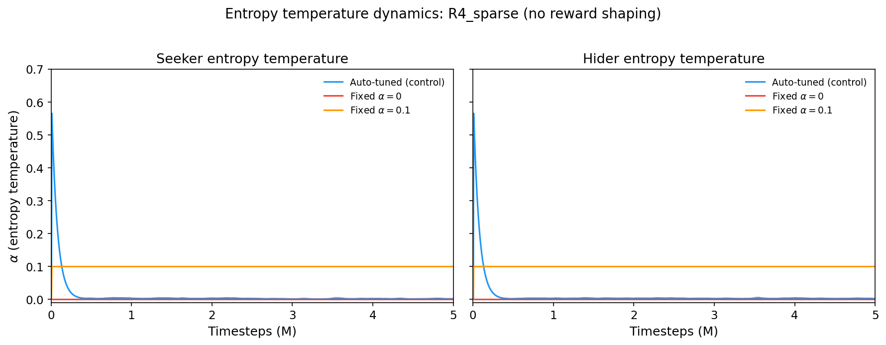
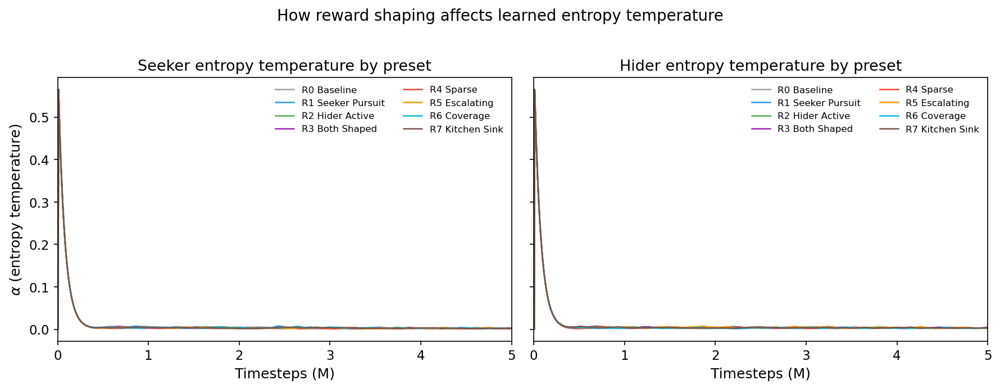
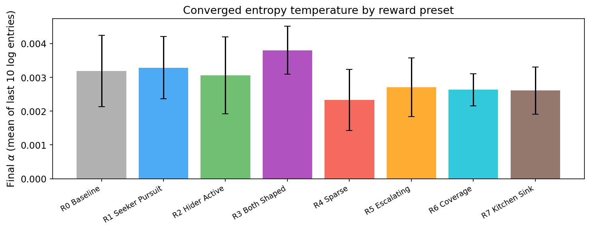
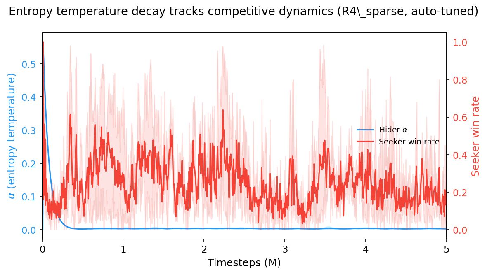

# Entropy Temperature Ablation

*Why SAC dominates competitive tag — and why a fixed entropy coefficient destroys learning.*

> **This is the third study in a series.** The [reward shaping study](../reward_shaping/) established that SAC produces stronger agents than PPO across 8 reward presets. The [HPO & zoo mixing study](../hpo_study/) confirmed this with optimized hyperparameters: SAC beats PPO 95-to-2 in cross-algorithm play, and zoo training has no effect. This study asks *why* SAC dominates.

---

## Background

**SAC** (Soft Actor-Critic) is an off-policy RL algorithm that adds an entropy bonus to the reward: the agent is incentivized to act *randomly* in addition to maximizing reward. The strength of this bonus is controlled by a temperature parameter **alpha**. Standard SAC auto-tunes alpha to maintain a target entropy level. **PPO** (Proximal Policy Optimization) is on-policy and has no such entropy mechanism (beyond a small fixed coefficient).

Our prior studies showed SAC dominates PPO [95-to-2 in cross-algorithm play](../hpo_study/#cross-algorithm-comparison), regardless of [reward shaping](../reward_shaping/), [zoo training](../hpo_study/#the-a-parameter-has-no-effect), or hyperparameter optimization. The natural hypothesis: SAC's entropy bonus acts as implicit reward shaping, encouraging diverse behavior that prevents degenerate strategies like corner-camping.

But is entropy actually the mechanism? This study tests that directly.

---

## Setup

All experiments use the same environment and evaluation methodology as the prior studies:

- **Arena:** 30x30 with 4 corner obstacles ("four_corners" layout). The **hider is 15% faster** than the seeker (HSM=1.15).
- **Observations:** 87-dimensional vectors including position, velocity, and 36 vision rays.
- **Episodes:** 200 action steps (10 seconds). The seeker wins by tagging (getting within 1.5 units); the hider wins by surviving.
- **Hyperparameters:** [Optuna-optimized](../hpo_study/) SAC settings (lr=2.25e-4, gamma=0.969, tau=0.00658, init_alpha=0.607, buffer=100K).
- **Evaluation:** Cross-evaluation gauntlet — every trained seeker plays every trained hider for 50 episodes. "Seeker strength" is average win rate as seeker; "hider survival" is average survival rate as hider; "combined" is their average. This avoids the [misleading within-run metrics](../hpo_study/#training-metrics-are-misleading) found in prior studies.

---

## Experiment 1A: The Entropy Counterfactual

We trained SAC on **R4 Sparse** — the hardest reward condition, with **no per-step shaping at all** (no distance rewards, no time penalties, no survival bonuses). Agents receive only terminal rewards: +10/-10 for tagging, +6/-6 for timeout. See the [reward shaping study](../reward_shaping/#reward-functions) for all 8 preset definitions.

Three entropy conditions:

| Condition | Description |
|-----------|-------------|
| **alpha=0** | Entropy disabled entirely — SAC becomes a pure actor-critic |
| **alpha=0.1** | Fixed moderate entropy — no auto-tuning |
| **control** | Standard SAC with automatic entropy tuning (init=0.607) |

Each condition: 3 seeds, 5M timesteps, 64 parallel environments.

### Alpha Trajectories

  

The auto-tuned control starts at alpha~0.57 and **crashes to ~0.003 within the first 500K steps**. Meanwhile, the fixed conditions stay flat at their assigned values.

The auto-tuned alpha settles 30x lower than the fixed alpha=0.1 condition. This is the first clue: whatever SAC needs from entropy, it's a *brief* high-entropy phase, not sustained exploration.

### Cross-Evaluation Results

All agents were cross-evaluated in an 11x11 gauntlet (all 3 counterfactual conditions + all 8 preset conditions, every seeker vs every hider, 50 episodes per matchup). Results for the 1A conditions:

| Condition | Seeker strength | Hider survival | Combined | Wall hugging* |
|-----------|:--------------:|:--------------:|:--------:|:------------:|
| **control** (auto-tuned) | **39.3%** | **74.9%** | **57.1%** | 0.78 |
| alpha=0 (no entropy) | 30.0% | 62.0% | 46.0% | 0.67 |
| alpha=0.1 (fixed) | 1.5% | 18.4% | 9.9% | 0.43 |

*\*Wall hugging: fraction of time the hider spends within 2 units of a wall, averaged across all matchups.*

**Key findings:**

1. **Auto-tuned entropy produces the strongest agents.** Both seeker and hider are substantially better than the other conditions.

2. **Fixed alpha=0.1 is catastrophically bad** — worse than *no entropy at all*. The seeker barely catches anyone (1.5%), and the hider survives only 18.4% of matches. A moderate fixed entropy coefficient doesn't just fail to help; it actively prevents learning.

3. **No entropy (alpha=0) is functional but weaker.** Agents learn reasonable strategies but can't match the auto-tuned version.

4. **Wall hugging doesn't tell the expected story.** Auto-tuned agents wall-hug *more* (0.78) than no-entropy agents (0.67). Entropy is not preventing degenerate wall-camping — the mechanism is something else.

---

## Experiment 1B: Alpha Dynamics Across Reward Presets

We trained SAC with auto-tuned entropy across all [8 reward presets](../reward_shaping/#reward-functions) (3 seeds each, 5M steps) to see whether the reward function affects the learned entropy schedule. The presets range from R0 (minimal shaping) through R4 (fully sparse — terminal rewards only) to R7 (all shaping terms combined).

### Alpha Trajectories by Preset

  

All 8 presets show **nearly identical alpha trajectories**: rapid decay from ~0.57 to ~0.003 within the first 500K steps, regardless of the reward function. The reward function does not meaningfully change the entropy schedule.

### Converged Entropy by Preset

  

Final alpha values cluster tightly between 0.002 and 0.004. R3 (Both Shaped) converges slightly higher; R4 (Sparse) slightly lower. But the differences are small — the entropy schedule is driven by the competitive dynamics, not the reward function.

### Cross-Evaluation Rankings

| Preset | Combined strength | Description |
|--------|:-----------------:|-------------|
| R2 Hider Active | **65.1%** | Anti-degenerate shaping (wall penalty + speed bonus) |
| R7 Kitchen Sink | 60.2% | All shaping terms combined |
| R4 Sparse | 60.0% | No shaping at all |
| R1 Seeker Pursuit | 58.9% | Strong distance pursuit signal |
| R0 Baseline | 58.8% | Minimal (small time penalty + survival bonus) |
| R5 Escalating | 46.8% | Escalating time pressure |
| R3 Both Shaped | 44.6% | Seeker pursuit + hider evasion combined |
| R6 Coverage | 42.5% | Exploration/area coverage bonus |

R4 Sparse (no shaping) ranks 3rd — nearly as strong as the best shaped reward. With SAC, **reward shaping is largely unnecessary**. But some shaping actively hurts: R3 (both agents shaped), R5 (escalating), and R6 (coverage) all perform *worse* than no shaping.

---

## The Mechanistic Story

### Entropy Tracks Competitive Dynamics

  

The alpha trajectory (blue) decays rapidly in the first 500K steps while the seeker win rate (red) oscillates wildly throughout training. The competitive arms race plays out *after* entropy has already collapsed to near-zero.

### Why Fixed Entropy Fails

The auto-tuned schedule has three phases:

1. **High entropy (0-200K steps):** Both agents explore widely, building diverse experience in the replay buffer. This bootstraps learning from the sparse terminal rewards.

2. **Rapid decay (200K-500K steps):** As policies improve, the entropy bonus becomes a distraction. Auto-tuning reduces alpha to get out of the way.

3. **Near-zero entropy (500K+ steps):** The competitive dynamics take over. Agents refine strategies against each other with minimal entropy interference.

Fixed alpha=0.1 is catastrophic because it **prevents phase 2 from completing**. The sustained entropy bonus keeps policies stochastic long after they should be converging, and in a competitive setting this means neither agent can develop the precise, committed strategies needed to catch or evade an opponent.

Fixed alpha=0 skips phase 1 entirely, which means agents miss the initial exploration that seeds the replay buffer with diverse transitions. They still learn — terminal rewards provide enough signal — but they converge to weaker strategies.

---

## Summary

| Finding | Implication |
|---------|------------|
| Auto-tuned alpha decays to ~0.003 | SAC needs a brief exploration phase, not sustained entropy |
| Fixed alpha=0.1 is catastrophic | Moderate fixed entropy prevents policy convergence in competitive games |
| Alpha trajectory is identical across 8 presets | The entropy schedule is driven by competitive dynamics, not reward design |
| R4 Sparse ranks 3rd with SAC | Reward shaping is largely unnecessary when using auto-tuned SAC |
| Auto-tuned agents wall-hug more | Entropy is not preventing degenerate behavior — the mechanism is exploration bootstrapping |

The critical design choice is not the reward function or the entropy coefficient — it's **letting the entropy temperature adapt**. In competitive self-play, the optimal entropy schedule is a rapid decay that SAC discovers automatically.

---

## Experimental Details

- **Environment:** 30x30 arena, four_corners layout, hider 15% faster (HSM=1.15), 200-step episodes (10s simulated time)
- **Algorithm:** SAC with [Optuna-optimized hyperparameters](../hpo_study/) (lr=2.25e-4, gamma=0.969, tau=0.00658, init_alpha=0.607, buffer=100K, batch=256, updates_per_step=4)
- **Training:** 5M timesteps per run, 64 parallel environments
- **Evaluation:** 11x11 cross-evaluation gauntlet, 50 episodes per matchup
- **Total runs:** 33 (9 counterfactual + 24 preset dynamics)
- **Compute:** [LUMI supercomputer](https://www.lumi-supercomputer.eu/), ~33 CPU-hours

---

**Study series:** [Reward Shaping](../reward_shaping/) | [HPO & Zoo Mixing](../hpo_study/) | Entropy Ablation (this page)

*[View source code](https://github.com/kilojoules/AI-Plays-Tag)*
