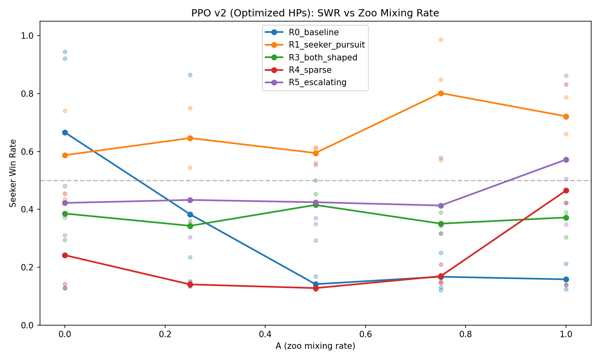
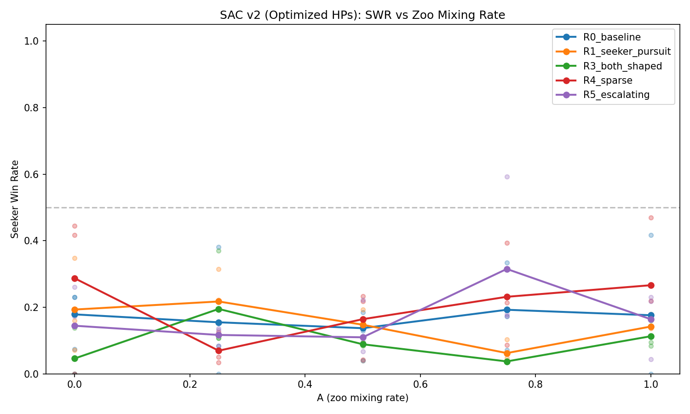
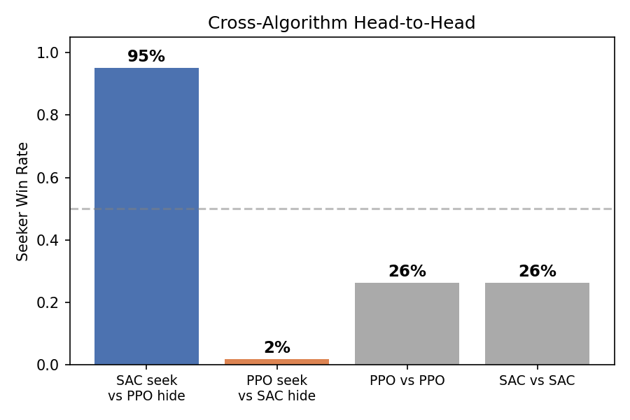
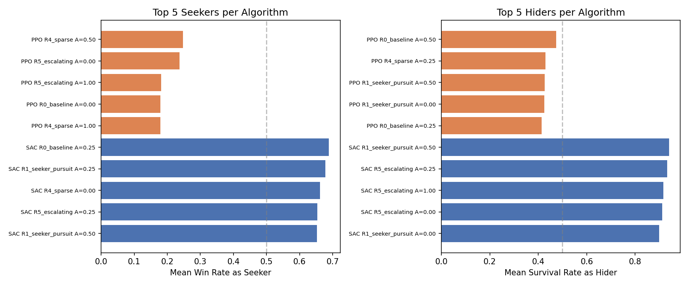
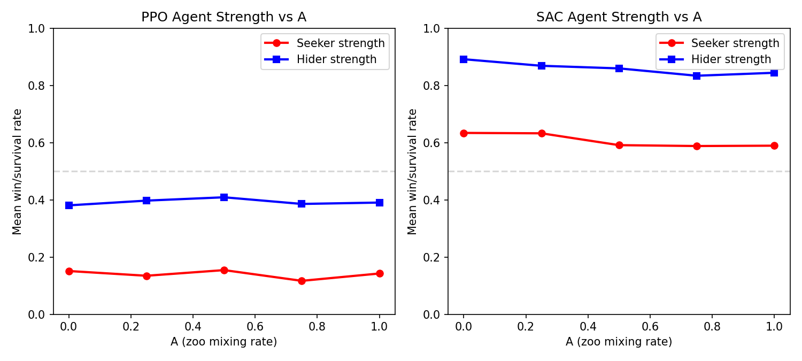
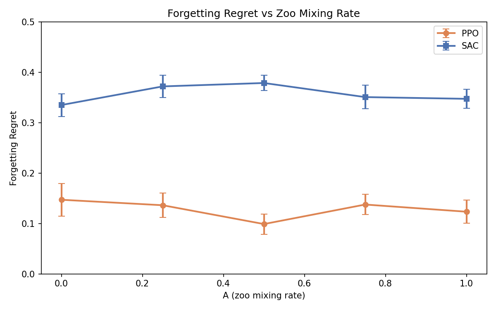

# Hyperparameter Tuning & Zoo Mixing Analysis

*Does training against a zoo of past opponents produce stronger agents? We optimized hyperparameters with Optuna, re-ran the full A-sweep, and found that the answer is no — but we discovered something more interesting along the way.*

---

## Motivation

Our [earlier study](../) found that zoo training (mixing in past opponents during self-play) improved seeker win rates across 20 game configurations. But that study used default hyperparameters and measured strength only against same-run opponents. Two questions remained:

1. **Are the default hyperparameters holding back one algorithm?** If PPO's defaults are poorly tuned, zoo training might appear to help simply because it compensates for bad optimization.
2. **Does zoo training produce agents that are strong against *all* opponents?** A high win rate against your own training partner doesn't guarantee robustness.

---

## Hyperparameter Optimization with Optuna

We used [Optuna](https://optuna.org/) to find optimal hyperparameters for both PPO and SAC via distributed Bayesian optimization on a SLURM cluster. Each trial trained self-play agents for 1M steps and maximized a balance score: $\min(\text{SWR}, 1 - \text{SWR})$, which peaks at 0.5 when the seeker and hider are evenly matched.

### Search Spaces

**PPO** (100 trials, 20 parallel workers, ~5 min/trial):

| Parameter | Range | Optimized |
|-----------|-------|-----------|
| Learning rate | $[3 \times 10^{-5},\; 3 \times 10^{-3}]$ (log) | $6.7 \times 10^{-4}$ |
| Discount $\gamma$ | $[0.95,\; 0.999]$ | $0.957$ |
| GAE $\lambda$ | $[0.9,\; 0.99]$ | $0.902$ |
| Clip ratio | $[0.1,\; 0.3]$ | $0.162$ |
| Train iterations | $[3,\; 20]$ | $20$ |
| Batch size | $\{1024, 2048, 4096\}$ | $4096$ |
| Entropy coefficient | $[0.001,\; 0.1]$ (log) | $0.014$ |
| Target KL | $[0.005,\; 0.05]$ | $0.022$ |

**SAC** (100 trials, 20 parallel workers, ~27 min/trial):

| Parameter | Range | Optimized |
|-----------|-------|-----------|
| Learning rate | $[10^{-4},\; 3 \times 10^{-3}]$ (log) | $2.3 \times 10^{-4}$ |
| Discount $\gamma$ | $[0.9,\; 0.999]$ | $0.969$ |
| Soft update $\tau$ | $[0.001,\; 0.05]$ (log) | $0.0066$ |
| Initial $\alpha$ | $[0.05,\; 1.0]$ (log) | $0.607$ |
| Buffer size | $\{25\text{K}, 50\text{K}, 100\text{K}, 250\text{K}, 500\text{K}\}$ | $100\text{K}$ |
| Batch size | $\{128, 256, 512\}$ | $256$ |
| Updates per step | $[1,\; 4]$ | $4$ |
| Warmup steps | $\{3\text{K}, 5\text{K}, 10\text{K}\}$ | $5\text{K}$ |

Both algorithms converged to **lower discount factors** ($\gamma \approx 0.96$) than the typical default of 0.99 — shorter-horizon credit assignment helps in this fast-paced game. PPO preferred larger batches and more optimization passes per update.

Best balance scores: **PPO 0.484**, **SAC 0.489** — both near-perfect 50/50 equilibrium.

### Technical Note: Bug Fix

During HPO development, we discovered a critical bug in the PPO self-play rollout: the environment was reset at the start of every rollout (32 env steps), making hider timeout episodes (200 steps) impossible to observe. This caused SWR=1.0 in all trials regardless of hyperparameters. The fix was to persist environment state across rollouts — matching the behavior of the zoo trainer.

---

## FR Sweep v2: Optimized Hyperparameters

Using the Optuna-optimized hyperparameters, we re-ran the full sweep:

$$
5 \text{ reward presets} \times 2 \text{ algorithms} \times 5\; A \text{ values} \times 3 \text{ seeds} = 150 \text{ runs at 5M steps each}
$$

### Training SWR Results

*PPO seeker win rate vs. zoo mixing rate A (optimized hyperparameters). Individual seeds shown as faded dots; lines show means across 3 seeds.*

*SAC seeker win rate vs. A. SAC remains hider-dominant (~15% SWR) across all configurations — but as the gauntlet reveals, this doesn't mean the agents are weak.*

The optimized hyperparameters improved PPO's mean balance score from 0.224 to 0.275 (+22%). SAC showed minimal change (+0.009), remaining hider-dominant during training.

---

## Cross-Config Gauntlet: Who's Actually Strong?

Training SWR tells you about balance within a run — not about absolute strength. To answer "does A produce stronger agents?", we ran a full cross-evaluation gauntlet:

- **50 configs** (best seed per preset/algo/A combination)
- **2,500 matchups** (all-vs-all), 50 episodes each
- **125,000 total evaluation episodes**

### SAC Dominates PPO

The result is unambiguous:

| Matchup | Seeker Win Rate |
|---------|:-:|
| SAC seeker vs PPO hider | **95%** |
| PPO seeker vs SAC hider | **2%** |
| PPO vs PPO (within-algo) | 26% |
| SAC vs SAC (within-algo) | 26% |

SAC produces dramatically stronger agents in both roles, despite appearing to "fail" during training (15% SWR, oscillating). Even the best PPO seeker wins only 2.3% against SAC hiders.

*Top 5 seekers and hiders per algorithm, ranked by mean performance across all opponents.*

### A Value Has No Effect on Strength

*Agent strength vs. zoo mixing rate, measured by gauntlet performance. Flat lines = A doesn't matter.*

Within each algorithm, varying A from 0.0 (pure self-play) to 1.0 (full zoo sampling) produces no meaningful change in agent strength:

**PPO within-algo (seeker WR):**

| A=0.00 | A=0.25 | A=0.50 | A=0.75 | A=1.00 |
|:------:|:------:|:------:|:------:|:------:|
| 28.4%  | 25.1%  | 29.0%  | 21.8%  | 26.8%  |

**SAC within-algo (seeker WR):**

| A=0.00 | A=0.25 | A=0.50 | A=0.75 | A=1.00 |
|:------:|:------:|:------:|:------:|:------:|
| 28.4%  | 30.5%  | 22.5%  | 24.8%  | 24.9%  |

No trend. Pure self-play (A=0) produces agents just as strong as full zoo training (A=1).

---

## Forgetting Regret

Despite zoo training's failure to improve strength, we observed massive forgetting — particularly in SAC:

*Forgetting Regret vs. zoo mixing rate. FR = peak balance score during training minus final balance score. Higher = more forgetting. Error bars = SE across seeds.*

| Algorithm | Mean FR | Runs with FR > 0.1 | Runs with FR > 0.2 |
|-----------|:-------:|:------------------:|:------------------:|
| **SAC**   | 0.357   | 75/75 (100%)       | 70/75 (93%)        |
| **PPO**   | 0.129   | 50/75 (67%)        | 12/75 (16%)        |

SAC agents reach near-perfect balance (peak ~0.50) within the first 1–2M steps, then collapse to SWR ~0.05 by 5M steps. Every single SAC run exhibits substantial forgetting. PPO shows less forgetting overall, but some runs (particularly R0_baseline) lose up to 0.44 balance.

**Does A reduce forgetting?** No — FR is flat across all A values for both algorithms.

---

## Conclusions

1. **The A-parameter hypothesis is dead.** Zoo mixing rate has no measurable effect on agent strength (gauntlet) or forgetting (FR analysis). Pure self-play produces agents just as capable as full zoo training.

2. **Algorithm choice is what matters.** SAC produces dramatically stronger agents than PPO (95% vs 2% in cross-algo play), despite appearing to fail during training. The self-play oscillation that makes SAC's training curves look bad may actually be beneficial — cycling through diverse strategies could produce policies with a wider behavioral repertoire.

3. **Training SWR is a poor proxy for agent quality.** SAC's 15% training SWR (hider-dominant) hides the fact that both the seeker and hider are learning robust, transferable behaviors. PPO's balanced-looking 40% SWR masks weaker overall agents.

4. **Optimized hyperparameters help modestly.** The Optuna-tuned parameters improved PPO's balance by 22% but didn't change the fundamental algorithm ranking. Both algorithms preferred lower discount factors ($\gamma \approx 0.96$) than typical defaults.

5. **Reward preset matters less than algorithm.** R5_escalating and R4_sparse produce slightly stronger agents, but the effect is small compared to the PPO/SAC gap. The reward design lessons from the [reward shaping study](../reward_shaping/) still apply for producing interesting *behaviors*, even if they don't dramatically affect competitive *strength*.

---

*150 training runs (5 presets × 2 algorithms × 5 A values × 3 seeds) at 5M steps each, with Optuna-optimized hyperparameters (200 HPO trials). Cross-evaluated with 2,500 gauntlet matchups × 50 episodes. Built with custom vectorized NumPy environment and PyTorch PPO/SAC.*

*[View source code](https://github.com/kilojoules/AI-Plays-Tag)*
