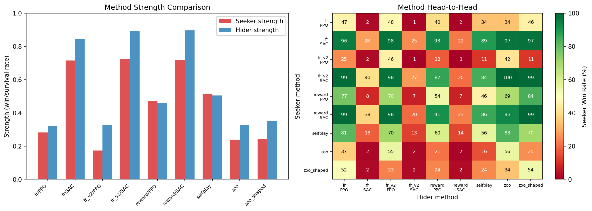
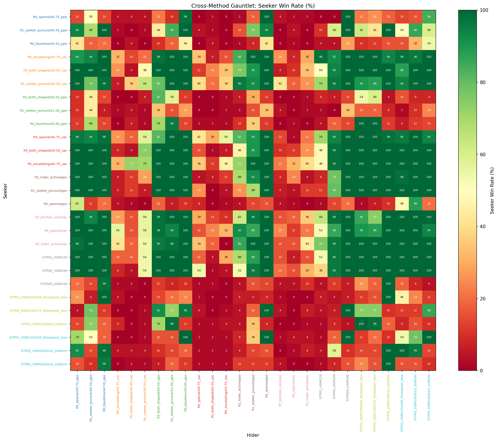
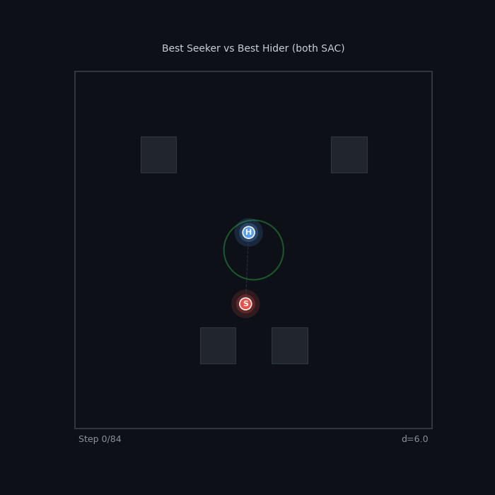
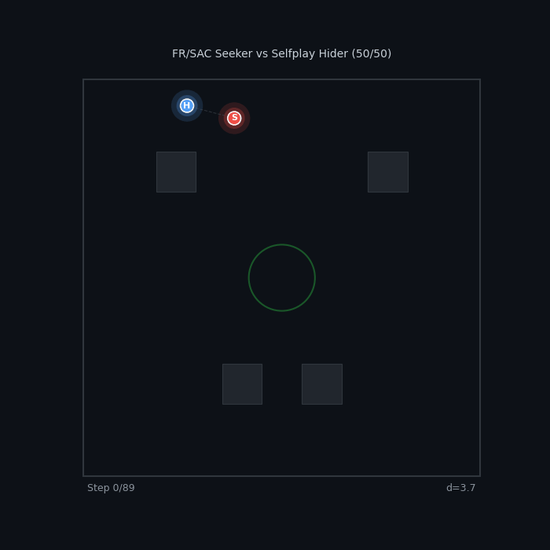
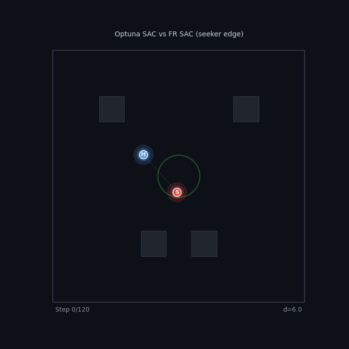
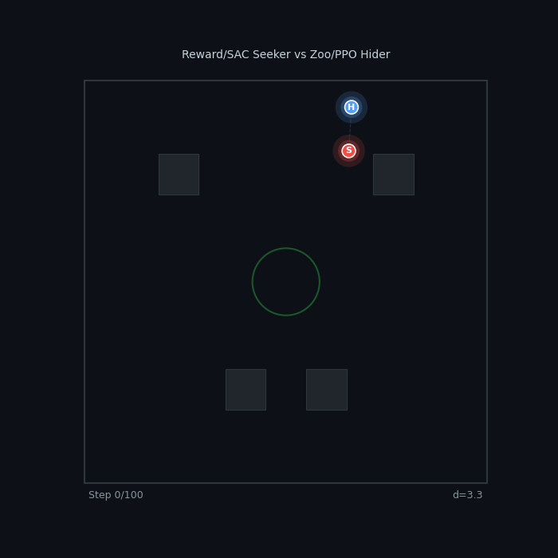
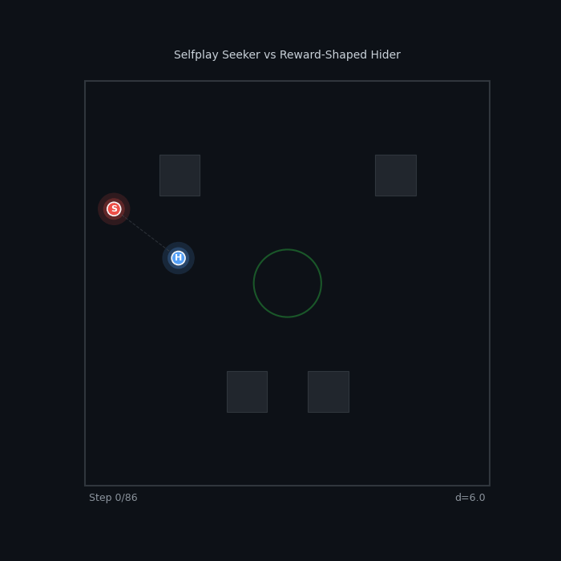

# Reward Shaping in Multi-Agent Tag

*How reward function design determines whether RL agents learn to play tag — or learn to hide in corners.*

---

## The Problem

Training two RL agents to play tag seems simple: the seeker gets a reward for catching, the hider gets a reward for surviving. But the details of reward shaping dramatically affect what behaviors emerge.

With minimal or sparse rewards, agents develop degenerate strategies:

<table>
<tr>
<td align="center"><b>R0 Baseline (PPO)</b> Passive pursuit, no urgency</td>
<td align="center"><b>R4 Sparse (PPO)</b> Wall camping, no real evasion</td>
</tr>
<tr>
<td></td>
<td></td>
</tr>
</table>

The baseline seeker wanders without urgency. The sparse-reward hider camps in a corner — technically optimal (maximizes distance), but not what we want.

---

## Environment

### Arena

The game takes place in a $30 \times 30$ bounded arena ($L = 15$, coordinates in $[-L, L]^2$) with 4 rectangular obstacles and a central safe zone. The hider has a 15% speed advantage over the seeker. Episodes last $T_{\max} = 200$ action steps (10 seconds of simulated time at $\Delta t = 1/60$ s, 3 physics substeps per action).

### State Space

At each timestep $t$, each agent $i \in \lbrace S, H \rbrace$ (seeker, hider) observes a vector $o_i^t \in \mathbb{R}^{87}$:

$$
o_i^t = \bigl[\, \underbrace{p_i / L}_{\text{position}},\; \underbrace{v_i / 10}_{\text{velocity}},\; \underbrace{(p_j - p_i)/L}_{\text{relative pos.}},\; \underbrace{(v_j - v_i)/10}_{\text{relative vel.}},\; \underbrace{\rho_i}_{\text{role flags}},\; \underbrace{(\cos\theta_i, \sin\theta_i)}_{\text{facing}},\; \underbrace{r_i \in \mathbb{R}^{72}}_{\text{vision rays}},\; \underbrace{z \in \mathbb{R}^3}_{\text{safe zone}} \,\bigr]
$$

where:
- $p_i \in \mathbb{R}^2$ is the agent's position, $v_i \in \mathbb{R}^2$ its velocity
- $j$ denotes the opponent
- $\rho_S = (1, 0)$, $\rho_H = (0, 1)$ are one-hot role flags
- $\theta_i$ is the facing angle
- $r_i$ consists of 36 rays spanning a 120° FOV, each returning (normalized distance, hit type) where hit type encodes wall (0), obstacle (0.5), or agent (1)
- $z = (\text{in\_zone}, \text{exhausted}, \text{cooldown\_frac})$ is the safe zone state

### Action Space

Each agent outputs a continuous action $a_i^t \in [-1, 1]^3$:

$$
a_i^t = (a_x, a_y, a_{\text{sprint}})
$$

where $(a_x, a_y)$ specify a target velocity direction scaled by max speed, and $a_{\text{sprint}}$ controls sprint intensity (unused in this study). The environment applies acceleration-based physics: $v_i \leftarrow v_i + \alpha(a_i \cdot v_{\max} - v_i)\Delta t$ with $\alpha = 20$ and $v_{\max} = 8.0$ for the seeker, $v_{\max} = 9.2$ for the hider.

### Tagging Condition

The seeker tags the hider when $\lVert p_S - p_H \rVert < d_{\text{tag}} = 1.5$, unless the hider is in the safe zone (radius 2.5, centered at origin) with remaining protection time.

---

## Reward Functions

All presets share the same **terminal rewards**:

$$
r_S^{\text{terminal}} = \begin{cases}
+W & \text{if tagged} \\
-W & \text{if timeout}
\end{cases}
\qquad
r_H^{\text{terminal}} = \begin{cases}
-W & \text{if tagged} \\
+B & \text{if timeout}
\end{cases}
$$

with win bonus $W = 10$ and timeout hider bonus $B = 6$. The presets differ in their per-step **shaping rewards**, which are summed to form the total per-step reward for each agent.

### Shaping Components

We define the following notation:

| Symbol | Definition |
|--------|-----------|
| $d_t = \lVert p_S^t - p_H^t \rVert$ | Inter-agent distance at step $t$ |
| $\Delta d_t = d_{t-1} - d_t$ | Distance progress (positive when seeker closes gap) |
| $w_H^t = L - \max(\lvert p_{H,x}^t \rvert, \lvert p_{H,y}^t \rvert)$ | Hider's minimum distance to any wall |
| $s_H^t = \lVert v_H^t \rVert$ | Hider speed |
| $\mathcal{G}_i^t \subseteq \lbrace 1, \ldots, 6 \rbrace^2$ | Set of $6 \times 6$ grid cells visited by agent $i$ up to step $t$ |
| $t / T_{\max}$ | Normalized episode progress |

The per-step shaping reward for each agent is:

$$
r_S^{\text{step}} = \underbrace{c_{\text{time}} \cdot f(t)}_{\text{time penalty}} + \underbrace{c_{\text{dist}} \cdot \Delta d_t}_{\text{pursuit shaping}} + \underbrace{c_{\text{cov}} \cdot \lvert \mathcal{G}_S^t \setminus \mathcal{G}_S^{t-1} \rvert}_{\text{coverage bonus}}
$$

$$
r_H^{\text{step}} = \underbrace{c_{\text{surv}}}_{\text{survival bonus}} - \underbrace{c_{\Delta d} \cdot \Delta d_t}_{\text{evasion (distance change)}} + \underbrace{c_{|d|} \cdot \frac{d_t}{L}}_{\text{absolute distance}} + \underbrace{c_{\text{wall}} \cdot \max\!\Big(0,\; 1 - \frac{w_H^t}{d_w}\Big)}_{\text{wall proximity penalty}} + \underbrace{c_{\text{speed}} \cdot \mathbb{1}[s_H^t > 1]}_{\text{speed bonus}} + \underbrace{c_{\text{cov}} \cdot \lvert \mathcal{G}_H^t \setminus \mathcal{G}_H^{t-1} \rvert}_{\text{coverage bonus}}
$$

where the time penalty scaling function is:

$$
f(t) = \begin{cases}
1 + t / T_{\max} & \text{if escalating urgency is enabled} \\
1 & \text{otherwise}
\end{cases}
$$

and $d_w = 2.0$ is the wall proximity threshold.

### Preset Coefficients

Each preset selects a subset of these terms by setting specific coefficients:

| Preset | $c_{\text{time}}$ | $f(t)$ | $c_{\text{dist}}$ | $c_{\text{surv}}$ | $c_{\Delta d}$ | $c_{\lvert d \rvert}$ | $c_{\text{wall}}$ | $c_{\text{speed}}$ | $c_{\text{cov}}$ |
|--------|-----------------:|:------:|------------------:|-----------------:|---------------:|---------------------:|-----------------:|-------------------:|-----------------:|
| **R0** Baseline | $-0.005$ | $1$ | $0$ | $0.01$ | $0$ | $0$ | $0$ | $0$ | $0$ |
| **R1** Pursuit | $-0.02$ | $1$ | $0.2$ | $0.01$ | $0$ | $0$ | $0$ | $0$ | $0$ |
| **R2** Active | $-0.005$ | $1$ | $0.14$ | $0.01$ | $0.14$ | $0.1$ | $-0.02$ | $0.005$ | $0$ |
| **R3** Both | $-0.02$ | $1$ | $0.2$ | $0.01$ | $0.14$ | $0.1$ | $-0.02$ | $0.005$ | $0$ |
| **R4** Sparse | $0$ | $1$ | $0$ | $0$ | $0$ | $0$ | $0$ | $0$ | $0$ |
| **R5** Escalating | $-0.01$ | $1 + t/T$ | $0.14$ | $0.01$ | $0$ | $0.1$ | $0$ | $0$ | $0$ |
| **R6** Coverage | $-0.005$ | $1$ | $0.14$ | $0.01$ | $0$ | $0.05$ | $0$ | $0$ | $0.1$ |
| **R7** Kitchen Sink | $-0.015$ | $1 + t/T$ | $0.2$ | $0.01$ | $0.14$ | $0.1$ | $-0.02$ | $0.005$ | $0.05$ |

Design rationale:
- **R0** and **R4** are controls: R0 has minimal shaping, R4 has none at all.
- **R1** tests whether strong seeker signals alone suffice.
- **R2** tests whether anti-degenerate hider shaping (wall penalty + speed bonus) prevents corner camping.
- **R3** combines R1 and R2 to see if both-agent shaping compounds.
- **R5** tests whether dynamic pressure (escalating time penalty) creates more interesting pursuit.
- **R6** tests whether exploration incentives (grid coverage bonus) help agents discover the full arena.
- **R7** combines everything, testing whether more terms always helps.

---

## Algorithms

Each preset is trained with two algorithms:

**PPO** (Proximal Policy Optimization) — on-policy actor-critic with clipped surrogate objective. Both agents collect rollouts simultaneously from 64 parallel environments, with batch size 4096 and 10 optimization epochs per update.

**SAC** (Soft Actor-Critic) — off-policy actor-critic that maximizes reward plus an entropy bonus $\mathcal{H}[\pi]$, with automatic temperature tuning. Each agent maintains a separate replay buffer (500K transitions), twin Q-networks, and squashed Gaussian policy. The entropy term is:

$$
J_\pi = \mathbb{E}\Big[\sum_t r_t + \alpha \mathcal{H}\big[\pi(\cdot \mid s_t)\big]\Big]
$$

where $\alpha$ is automatically tuned to maintain target entropy $-\dim(\mathcal{A}) = -3$. This implicit exploration bonus proves critical for hider performance.

Both algorithms use the same network architecture: 2-layer MLP (256 hidden units, ReLU activations). All runs use learning rate $3 \times 10^{-4}$, $\gamma = 0.99$, and train for 5M timesteps across 3 random seeds.

---

## What Good Behavior Looks Like

With the right reward shaping, agents learn genuine pursuit and evasion:

<table>
<tr>
<td align="center"><b>R2 Active Hider (PPO)</b> Wall penalty + speed bonus</td>
<td align="center"><b>R5 Escalating (SAC)</b> Increasing seeker urgency</td>
</tr>
<tr>
<td></td>
<td></td>
</tr>
<tr>
<td align="center"><b>R3 Both Shaped (SAC)</b> Seeker pursuit + hider evasion</td>
<td align="center"><b>R7 Kitchen Sink (PPO)</b> All shaping terms combined</td>
</tr>
<tr>
<td></td>
<td></td>
</tr>
</table>

## Cross-Config Gauntlet

To measure which reward functions produce *genuinely capable* agents (not just agents that look good against their training partner), I ran a full cross-evaluation: every seeker vs every hider across all 16 configurations, 20 episodes per matchup (256 matchups total).

*Each cell shows seeker win rate (%). Rows = seeker config, columns = hider config. Green = seeker wins, red = hider survives.*

### Key Patterns

The heatmap reveals a striking **algorithm asymmetry**: SAC hiders (odd columns) are dramatically harder to catch than PPO hiders (even columns), forming a clear vertical stripe pattern. Meanwhile, SAC and PPO seekers are more comparable.

## Seeker and Hider Strength

Aggregating across all opponents gives each config's overall strength:

**Findings:**

- **SAC dominates hider performance** — every SAC hider achieves 65–87% survival rate vs 7–45% for PPO hiders. SAC's entropy maximization naturally encourages diverse, hard-to-predict evasion.
- **Shaped PPO seekers match SAC** — R7 Kitchen Sink PPO (60% win rate) rivals the best SAC seekers. Dense reward shaping compensates for PPO's lack of entropy bonus.
- **Sparse rewards fail for PPO** — R4 Sparse PPO produces the worst agents in both roles (7% each). But R4 Sparse *SAC* produces the best hider (87% survival) — SAC's entropy bonus compensates for missing reward signal.
- **More shaping isn't always better** — R7 Kitchen Sink doesn't dominate. R5 Escalating SAC is the strongest seeker (64%), and it uses fewer reward terms than R7.

## PPO vs SAC

*Points above the diagonal = SAC is stronger. Nearly all hider points sit above the line — SAC produces fundamentally better evaders.*

The algorithm comparison reveals that the PPO vs SAC choice matters more for hiders than seekers. Pursuit is a relatively simple objective that PPO can solve with enough reward shaping. Evasion requires the kind of stochastic, unpredictable behavior that SAC's entropy maximization provides naturally.

## Learning Curves

*Seeker win rate over training (mean $\pm$ std across 3 seeds). 50% = balanced game.*

Notable dynamics:
- **R4 Sparse PPO** never learns — win rate stays near 20% throughout training
- **R1 Pursuit PPO** spikes to 80%+ early then stabilizes — strong seeker shaping converges fast
- **SAC curves are noisier** but generally converge to more balanced equilibria (closer to 50%)
- **R5 Escalating** shows the most interesting dynamics — win rate oscillates as agents co-adapt

## Reward Design Lessons

1. **Anti-degenerate shaping matters more than reward magnitude.** The wall proximity penalty $c_{\text{wall}}$ and speed bonus $c_{\text{speed}}$ (R2) prevent corner camping more effectively than increasing other reward terms.

2. **Algorithm choice interacts with reward design.** SAC with sparse rewards ($c = 0$ everywhere) outperforms PPO with dense rewards for evasion — the entropy bonus $\alpha \mathcal{H}[\pi]$ is a form of implicit reward shaping.

3. **Escalating pressure creates drama.** R5's time-scaling $f(t) = 1 + t/T_{\max}$ produces the most dynamic episodes because the seeker's behavior visibly shifts from cautious to aggressive as time runs out.

4. **Kitchen sink is not optimal.** R7 uses every shaping term but doesn't produce the best agents. The reward terms can conflict — the coverage bonus $c_{\text{cov}}$ pulls agents away from each other, undermining pursuit/evasion signals from $c_{\text{dist}}$ and $c_{\Delta d}$.

---

## Cross-Method Gauntlet

The within-preset gauntlet above answers *which reward function is best?* — but a bigger question remained: **which training method produces the strongest opponents?** We ran experiments across six different training paradigms, each producing agents via different mechanisms:

| Method | Training paradigm | Algorithm | Runs |
|--------|-------------------|-----------|------|
| **Selfplay** | Rolling opponent updates | PPO | 20 configs |
| **Reward shaping** | Self-play + reward presets | PPO, SAC | 8 presets $\times$ 2 algos |
| **Zoo** | Opponent sampling from checkpoint zoo | PPO | 280 configs |
| **Zoo + hider shaping** | Zoo with shaped hider rewards | PPO | 200 configs |
| **FR sweep** | Zoo + reward presets + A-mixing | PPO, SAC | 50 configs |
| **FR sweep v2** | Optuna-optimized hyperparameters | PPO, SAC | 50 configs |

From 616 total trained agents across 9 method-algorithm combinations, we selected the top 3 representatives per method (most balanced, best seeker, best hider) and ran a full $27 \times 27 = 729$ matchup gauntlet at 50 episodes each.

### Method Head-to-Head

*Left: seeker and hider strength by method. Right: method head-to-head matrix (seeker WR).*

| Method | Seeker | Hider | Combined |
|--------|-------:|------:|---------:|
| **FR v2 / SAC** | 72.6% | 89.1% | **80.9%** |
| **Reward / SAC** | 71.9% | 89.7% | **80.8%** |
| **FR / SAC** | 71.6% | 84.4% | **78.0%** |
| Selfplay | 51.6% | 50.5% | 51.0% |
| Reward / PPO | 47.0% | 45.9% | 46.4% |
| FR / PPO | 28.2% | 32.0% | 30.1% |
| Zoo shaped | 24.2% | 35.0% | 29.6% |
| Zoo | 23.9% | 32.5% | 28.2% |
| FR v2 / PPO | 17.4% | 32.6% | 25.0% |

The results reveal a stark **two-tier structure**: all three SAC-based methods cluster at 78–81% combined strength, while PPO and zoo methods sit at 25–51%. The algorithm choice (SAC vs PPO) matters far more than the training paradigm (self-play vs zoo vs reward presets).

### Full Gauntlet Heatmap

*Each cell: seeker win rate (%). Rows = seeker, columns = hider. Labels colour-coded by method.*

The heatmap shows clear block structure: SAC agents (from any method) dominate PPO/zoo agents with 84–100% win rates. The only competitive matchups occur *within* the SAC tier, where win rates range from 12–70%.

### Showcase: Cross-Method Matchups

<table>
<tr>
<td align="center"><b>Best Seeker vs Best Hider</b> FR v2 Escalating SAC vs FR v2 Both-Shaped SAC <em>12% seeker WR — the hider is nearly uncatchable</em></td>
<td align="center"><b>Perfect Rivals</b> FR/SAC Seeker vs Selfplay Hider <em>50/50 — knife-edge balance across methods</em></td>
</tr>
<tr>
<td></td>
<td></td>
</tr>
<tr>
<td align="center"><b>SAC Mirror Match</b> Optuna SAC Seeker vs FR SAC Hider <em>70% WR — escalating pressure overcomes evasion</em></td>
<td align="center"><b>Tier Gap: SAC vs Zoo</b> Reward/SAC Seeker vs Zoo/PPO Hider <em>~98% WR — the zoo hider has no answer</em></td>
</tr>
<tr>
<td></td>
<td></td>
</tr>
<tr>
<td align="center" colspan="2"><b>Selfplay vs Reward-Shaped</b> Selfplay Seeker vs R2 Active Hider (PPO) <em>~52% — pure self-play competes with shaped rewards</em></td>
</tr>
<tr>
<td align="center" colspan="2"></td>
</tr>
</table>

### Key Findings

1. **SAC is the dominant factor.** Whether agents trained via self-play, zoo sampling, or reward-preset sweeps, SAC consistently produced stronger agents than PPO. The entropy bonus $\alpha \mathcal{H}[\pi]$ acts as a universal "reward shaping" that cannot be replicated by hand-crafted reward terms.

2. **Zoo training underperforms.** Despite training against diverse opponents (checkpoint zoo with A-parameter mixing), zoo-trained PPO agents placed last. Opponent diversity during training did not translate to stronger final policies — the algorithm ceiling mattered more.

3. **Optuna tuning helps marginally.** FR v2 (Optuna-optimized hyperparameters) edged out the hand-tuned FR sweep for SAC (80.9% vs 78.0%), but the gap is small compared to the PPO/SAC divide.

4. **Selfplay PPO is the best PPO method.** Plain self-play without reward shaping or zoo mechanics achieved 51% combined — the highest among PPO methods. This suggests that for PPO, simpler training setups avoid overfitting to specific reward incentives.

5. **The toughest opponents are both SAC.** The hardest seeker to evade: **FR v2 R5 Escalating SAC** (77% WR). The hardest hider to catch: **FR v2 R3 Both-Shaped SAC** (93% survival). Both emerged from Optuna-tuned zoo training with reward presets.

---

*616 agents across 6 training methods, 9 method-algorithm combinations. Top-3 per method selected by training balance, yielding $27 \times 27 = 729$ cross-evaluation matchups at 50 episodes each. Built with custom vectorized NumPy environment and PyTorch PPO/SAC.*

*[View source code](https://github.com/kilojoules/AI-Plays-Tag)*
