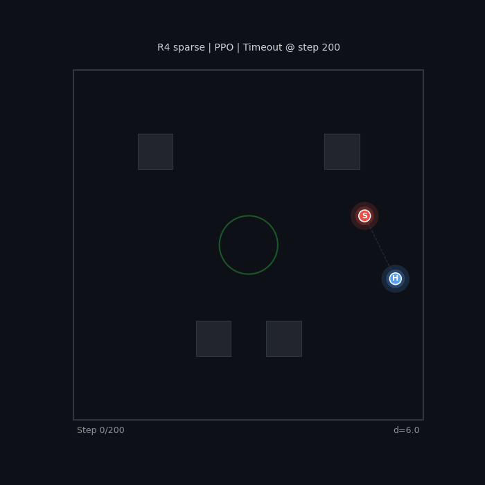
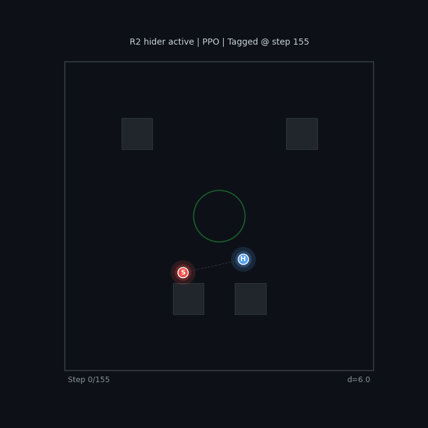
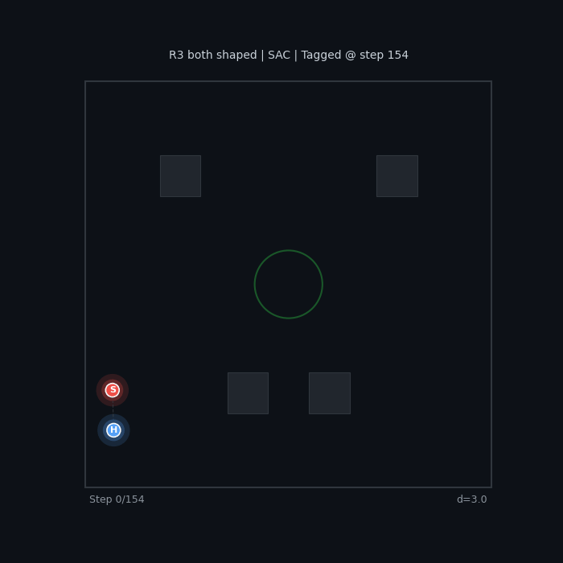
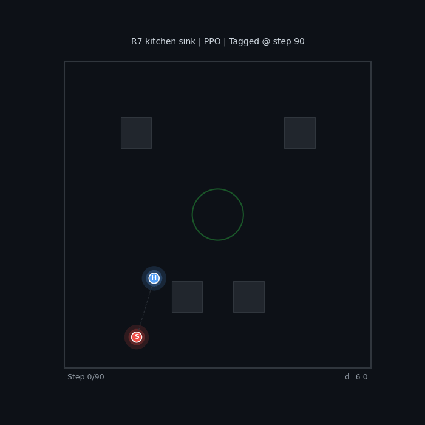
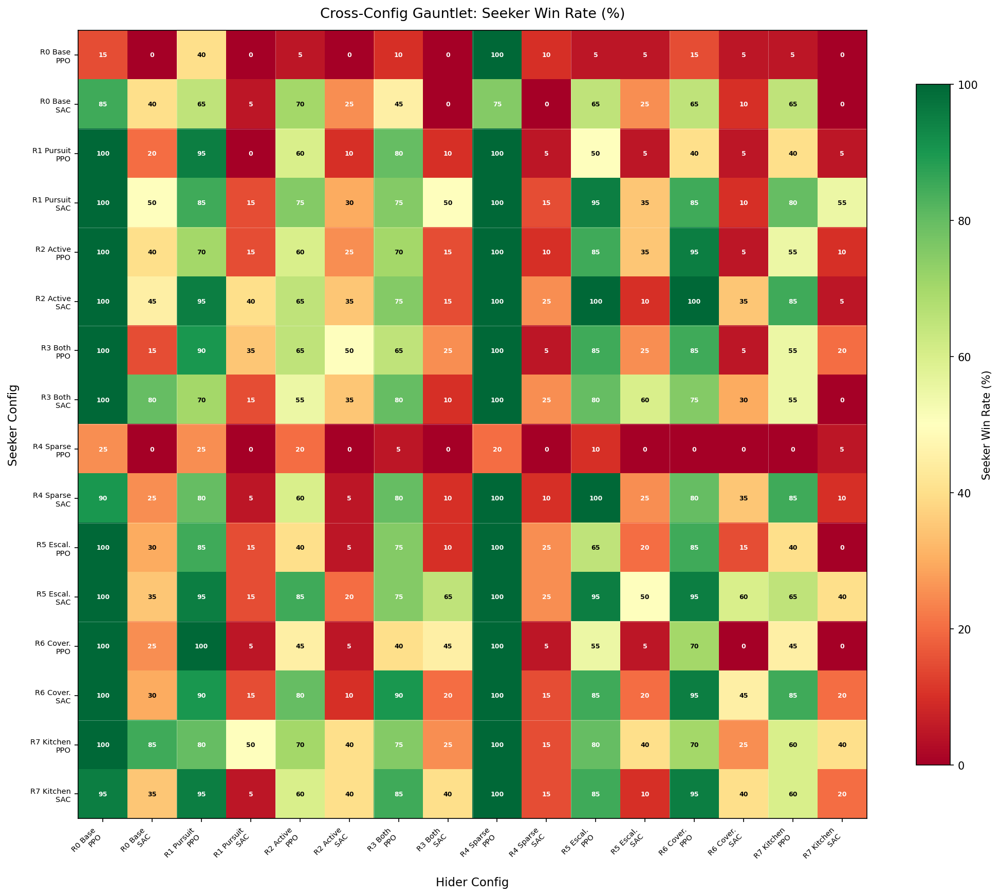
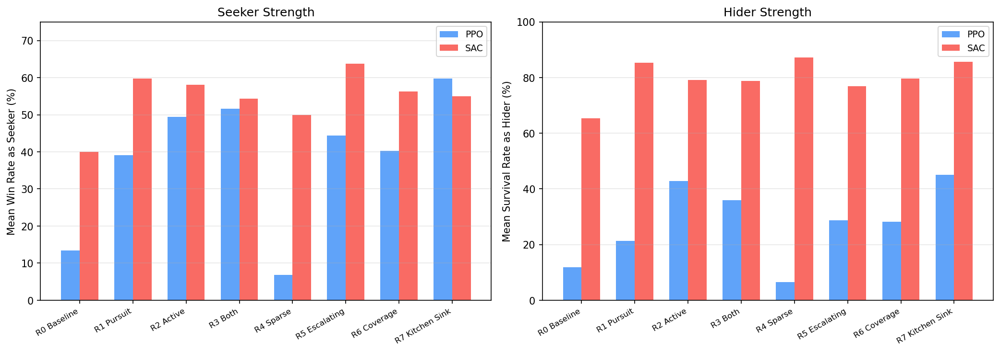
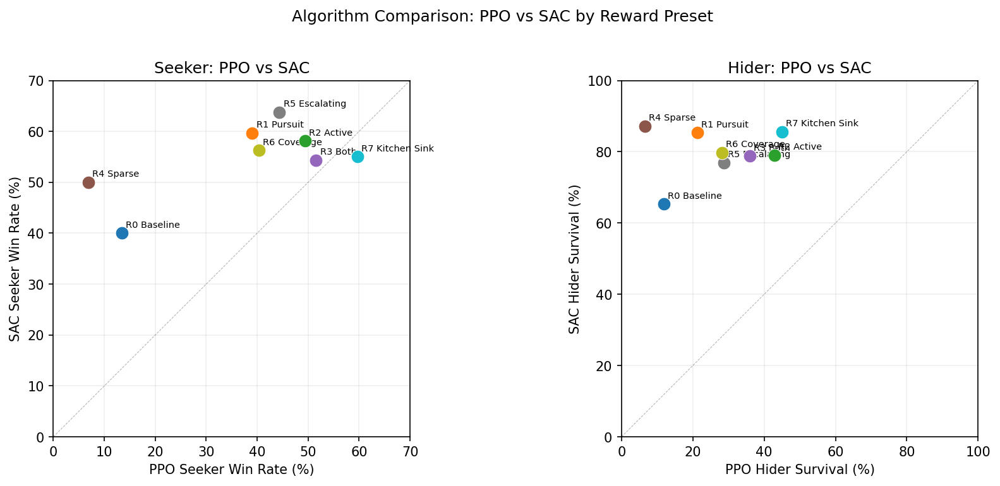
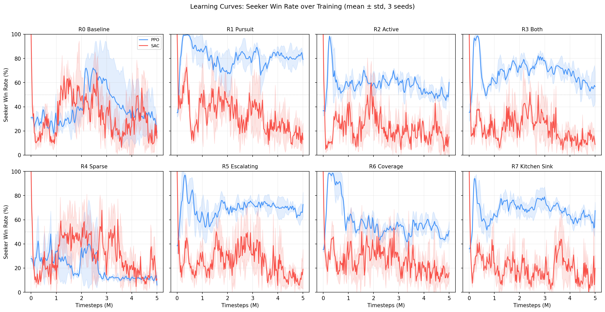

# Reward Shaping in Multi-Agent Tag

*How reward function design determines whether RL agents learn to play tag — or learn to hide in corners.*

---

## The Problem

Training two RL agents to play tag seems simple: the seeker gets a reward for catching, the hider gets a reward for surviving. But the details of reward shaping dramatically affect what behaviors emerge.

With minimal or sparse rewards, agents develop degenerate strategies:

<table>
<tr>
<td align="center"><b>R0 Baseline (PPO)</b> Passive pursuit, no urgency</td>
<td align="center"><b>R4 Sparse (PPO)</b> Wall camping, no real evasion</td>
</tr>
<tr>
<td></td>
<td></td>
</tr>
</table>

The baseline seeker wanders without urgency. The sparse-reward hider camps in a corner — technically optimal (maximizes distance), but not what we want.

## Experimental Design

I designed **8 reward presets** spanning minimal to heavily shaped, and trained each with **2 algorithms** (PPO, SAC) across **3 seeds** — 48 runs total, 5M timesteps each in pure self-play.

| Preset | Seeker Shaping | Hider Shaping | Key Idea |
|--------|---------------|---------------|----------|
| **R0 Baseline** | Small time penalty | Survival bonus | Minimal signal |
| **R1 Pursuit** | Strong distance + time penalty | None | Seeker-focused |
| **R2 Active** | Distance shaping | Distance + wall penalty + speed bonus | Force active evasion |
| **R3 Both** | Strong pursuit | Active evasion | Both agents shaped |
| **R4 Sparse** | None | None | Terminal rewards only |
| **R5 Escalating** | Time penalty doubles over episode | Distance shaping | Increasing urgency |
| **R6 Coverage** | Distance shaping | Distance + exploration bonus | Reward arena coverage |
| **R7 Kitchen Sink** | Everything | Everything | All terms combined |

### Environment

- 30×30 arena with 4 obstacle blocks and a central safe zone
- Hider has 15% speed advantage
- 10-second episodes (200 action steps)
- Vision: 36 rays, 120° FOV

## What Good Behavior Looks Like

With the right reward shaping, agents learn genuine pursuit and evasion:

<table>
<tr>
<td align="center"><b>R2 Active Hider (PPO)</b> Wall penalty + speed bonus</td>
<td align="center"><b>R5 Escalating (SAC)</b> Increasing seeker urgency</td>
</tr>
<tr>
<td></td>
<td></td>
</tr>
<tr>
<td align="center"><b>R3 Both Shaped (SAC)</b> Seeker pursuit + hider evasion</td>
<td align="center"><b>R7 Kitchen Sink (PPO)</b> All shaping terms combined</td>
</tr>
<tr>
<td></td>
<td></td>
</tr>
</table>

## Cross-Config Gauntlet

To measure which reward functions produce *genuinely capable* agents (not just agents that look good against their training partner), I ran a full cross-evaluation: every seeker vs every hider across all 16 configurations, 20 episodes per matchup.

*Each cell shows seeker win rate (%). Rows = seeker config, columns = hider config. Green = seeker wins, red = hider survives.*

### Key Patterns

The heatmap reveals a striking **algorithm asymmetry**: SAC hiders (odd columns) are dramatically harder to catch than PPO hiders (even columns), forming a clear vertical stripe pattern. Meanwhile, SAC and PPO seekers are more comparable.

## Seeker and Hider Strength

Aggregating across all opponents gives each config's overall strength:

**Findings:**

- **SAC dominates hider performance** — every SAC hider achieves 65-87% survival rate vs 7-45% for PPO hiders. SAC's entropy maximization naturally encourages diverse, hard-to-predict evasion.
- **Shaped PPO seekers match SAC** — R7 Kitchen Sink PPO (60% win rate) rivals the best SAC seekers. Dense reward shaping compensates for PPO's lack of entropy bonus.
- **Sparse rewards fail for PPO** — R4 Sparse PPO produces the worst agents in both roles (7% each). But R4 Sparse *SAC* produces the best hider (87% survival) — SAC's entropy bonus compensates for missing reward signal.
- **More shaping isn't always better** — R7 Kitchen Sink doesn't dominate. R5 Escalating SAC is the strongest seeker (64%), and it uses fewer reward terms than R7.

## PPO vs SAC

*Points above the diagonal = SAC is stronger. Nearly all hider points sit above the line — SAC produces fundamentally better evaders.*

The algorithm comparison reveals that the PPO vs SAC choice matters more for hiders than seekers. Pursuit is a relatively simple objective that PPO can solve with enough reward shaping. Evasion requires the kind of stochastic, unpredictable behavior that SAC's entropy maximization provides naturally.

## Learning Curves

*Seeker win rate over training (mean ± std across 3 seeds). 50% = balanced game.*

Notable dynamics:
- **R4 Sparse PPO** never learns — win rate stays near 20% throughout training
- **R1 Pursuit PPO** spikes to 80%+ early then stabilizes — strong seeker shaping converges fast
- **SAC curves are noisier** but generally converge to more balanced equilibria (closer to 50%)
- **R5 Escalating** shows the most interesting dynamics — win rate oscillates as agents co-adapt

## Reward Design Lessons

1. **Anti-degenerate shaping matters more than reward magnitude.** The wall proximity penalty and speed bonus (R2) prevent corner camping more effectively than increasing other reward terms.

2. **Algorithm choice interacts with reward design.** SAC with sparse rewards outperforms PPO with dense rewards for evasion — the entropy bonus is a form of implicit reward shaping.

3. **Escalating pressure creates drama.** R5's time-scaling penalty produces the most dynamic episodes because the seeker's behavior visibly shifts from cautious to aggressive as time runs out.

4. **Kitchen sink is not optimal.** R7 uses every shaping term but doesn't produce the best agents. The reward terms can conflict — coverage bonus pulls agents away from each other, undermining pursuit/evasion signals.

---

*48 training runs (8 reward × 2 algorithms × 3 seeds), 5M timesteps each. Cross-evaluated with 256 matchups × 20 episodes. Built with custom vectorized NumPy environment and PyTorch PPO/SAC.*

*[View source code](https://github.com/JuliusQv/AI-Plays-Tag)*
